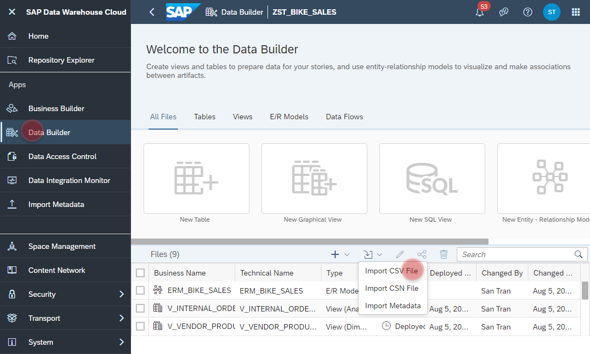
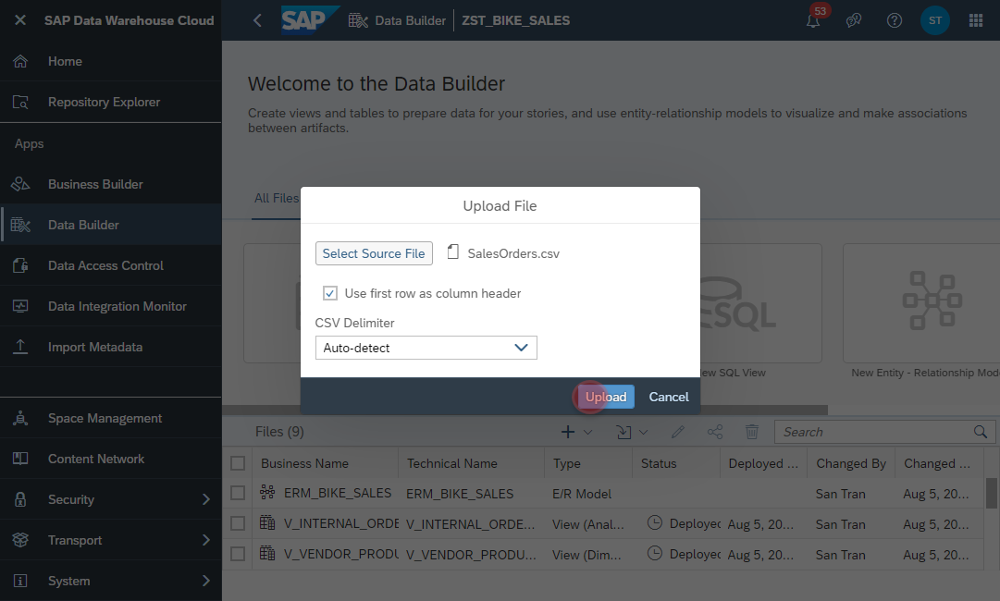
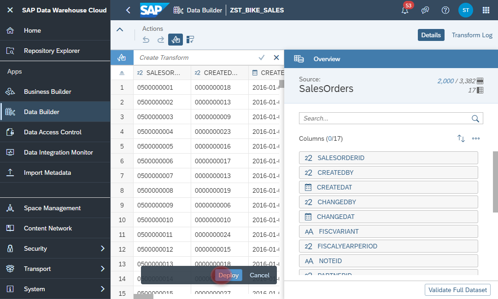
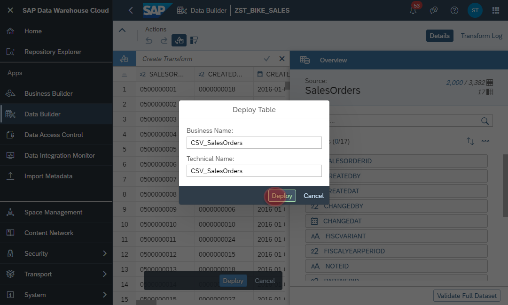

# Exercise 1 - Upload CSV Files

## Upload CSV Files for <i>Bike Sales</i>
In this exercise, we will learn how to bring data into SAP Data Warehouse Cloud by uploading some sample datasets. This is a prerequiste for all follow-up exercises. 

1. Download the sample dataset via the following link: https://github.com/d031182/reference-data-model-samples/tree/main/data/BIKE_SALES
    - Make sure the following fiiles are available (last update 30th August 2021):
        - SalesOrders.csv
        - SalesOrderItems.csv
        - Addresses.csv
        - BusinessPartners.csv
        - Products.csv
        - ProductTexts.csv
        - InternalOrders.csv
        - VendorProduct.csv
        - VendorProductCategoryHierarchy.csv
        - Employees.csv
      
    

2. Navigate to the Data Builder of SAP Data Warehouse Cloud
3. Click on the <b><i>Import CSV File</i></b>
  
4. Select a source file, e.g. SalesOrders.csv, Products.csv, etc. 
5. Click on <b><i>Upload</i></b>
  
6. In this page you will have the options to wrangle and adopt the data to your needs, e.g.:
    - Change Data Types
    - Concatenate different columns into one
    - Replace NULL values with appropriate value of your choice
    - etc.
7. For our exercise it's good enough to click on the <b><i>Deploy</i></b> Button to move on.
  
8. Set the name of the table, which will be created to store the data. In our example please add a prefix <b>CSV_</b> to the CSV filename, e.g. <b><i>CSV_SalesOrders</i></b>.
9. The click again on the <b><i>Deploy</i></b> Button
  
10. Please repeat these steps for all other downloaded CSV files 

## Upload CSV Files for <i>SFLIGHT</i>
1. Download the sample dataset via the following link:
https://github.com/d031182/reference-data-model-samples/tree/main/data/SFLIGHT
    - Make sure the following fiiles are available (last update 30th August 2021):
            - TCURR.csv
            - TCURF.csv
            - TCURV.csv
            - TCURX.csv
            - SFLIGHT.csv
   

## Summary

You've imported all sample data, that is required for all follow up exercises.

Continue to - [Exercise 2](../ex2/README.md)

