# Create <i>Business Partners</i> View
In this exercise we will create our first View of type *Dimension*. 
>:mortar_board: **Dimension**:
>A Dimension is a term which comes from the OLAP (Online Analytical Processing) and Starschema domain. It represents Master Data such as Business Partners, Products, Customers, Sales Organization. Master Data usually carries texts and descriptive attributes, which exist in multiple languages. 

1. Navigate to the Repository Explorer
2. Click on <b><i>Create - Graphical View</i></b> Button to create a new view
    

3. Click on **Details** button and configure the following properties:
    - Business Name: <b>V_BUSINESS_PARTNERS</b>
    - Technical Name: <b>V_BUSINESS_PARTNERS</b>
    - Semantic Usage: <b>Dimension</b>
    - Expose for Consumption: <b>ON</b>
     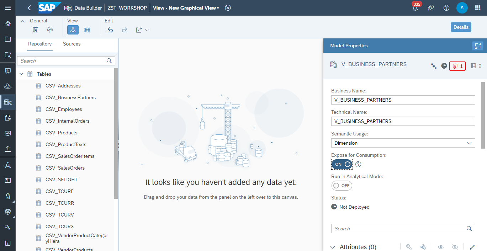
   

### Join Node
4. Drag and drop the table <b><i>CSV_BusinessPartners</i></b> into the canvas
    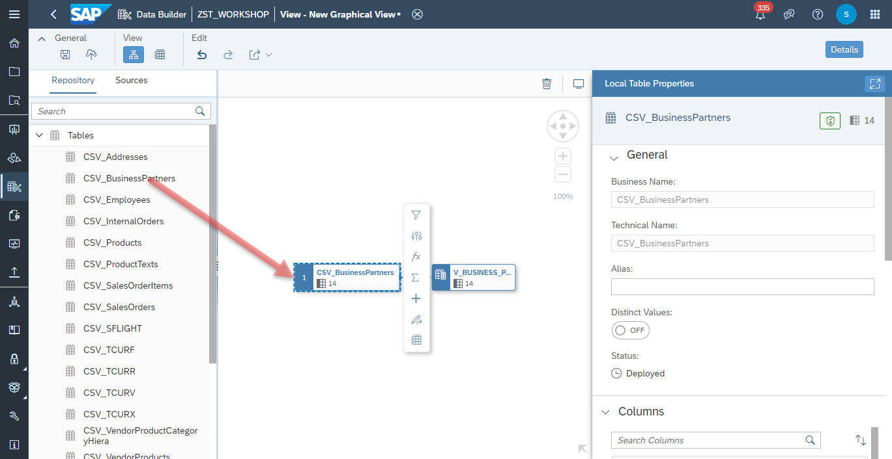 
5. Drag and drop the table <b><i>CSV_Addresses</i></b> into the canvas and drop it directly on the CSV_BusinessPartners Node.
6. Select from the context menu <b>Join</b>
    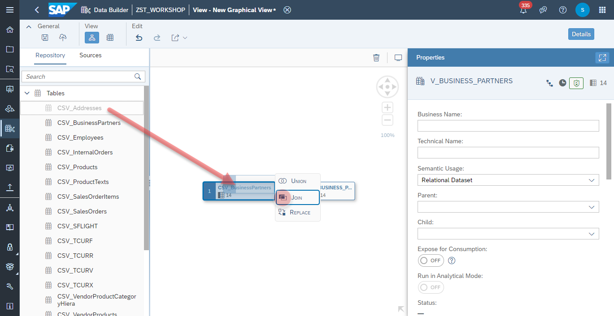

7. A new <b>Join Node</b> and a <b>Projection Node</b> will created

8. Select the <b>Join Node</b> and map the column <b>CSV_BusinessPartners.ADDRESSID</b> with the column <b>CSV_Addresses.ADDRESSID</b>
    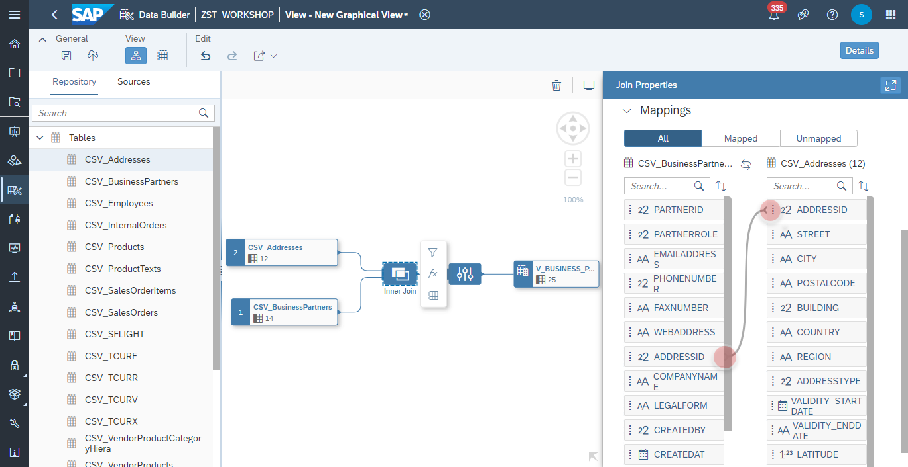

9. Furthermore, you can adjust the **<i>Join Type</i>**. Following Join Types are currently supported:
    - Inner Join
    - Left Join
    - Right Join
    - Full Outer Join 
    - Cross Join
        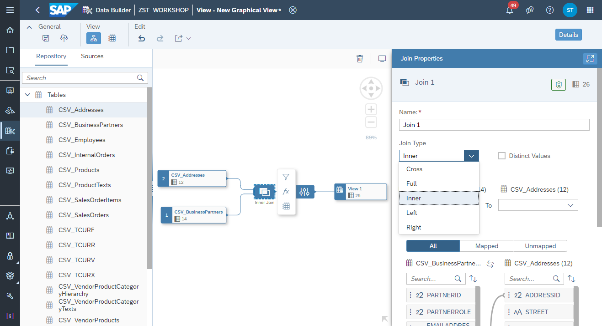

10. You can also set the join cardinality:
    - Exactly One (1)
    - One (0..1)
    - Many (*)
  
    The cardinality information is utilized in SAP HANA Cloud to optimize the query execution and for that also the overall performance.
      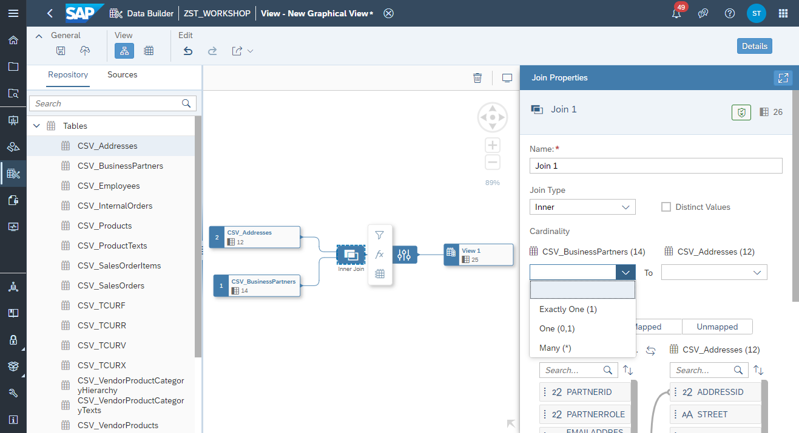

### Projection Node
With the projection node, you can exclude or restore columns from your model. Hence, they won't be available nor consumpable on the client side, such as SAP Analytics Cloud. 

11. Select the *Projection Node* and **exclude** the **FAXNUMBER** from the Node. 
   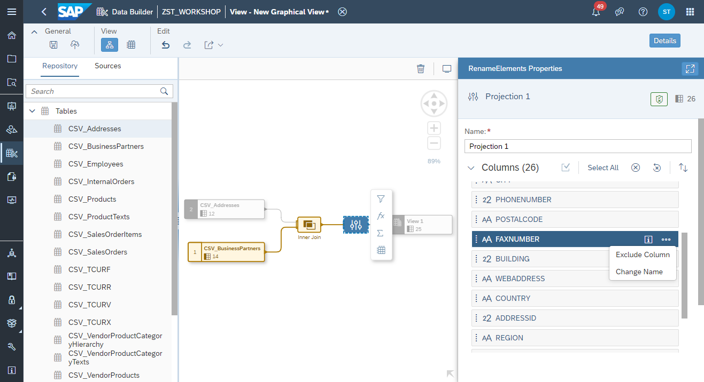

  
### Id and Text
>**Id and Text**: Master Data usually consists an identifier (e.g. Cost Center Id) and a textual description (Cost Center Name). Depending on the reporting requirement, users might want to display one or the other (or both) in the story. This particular semantic and relation between an Id and Text can be modelled in SAP Data Warehouse Cloud.

11. Select the <i>Output Node</i> and navigate to the <i>Attributes</i> section and click on <b>Edit Attriutes</b> button:
    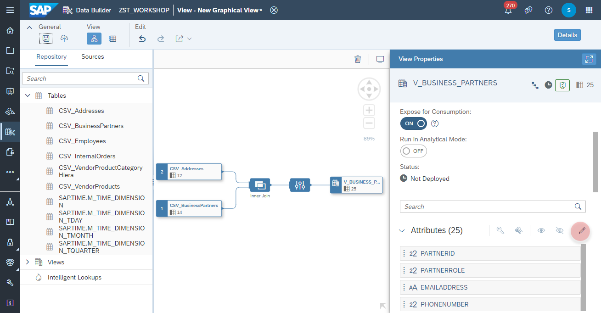
12. Adjust the following attribute properties:
    - <b>COMPANYNAME</b>: set the semantic type to <b>TEXT</b>
    - <b>PARTNERID</b>: set the label to <b>COMPANYNAME</b>
    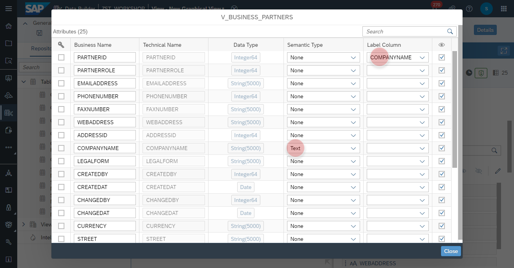

### Level Based Hierarchy
13. Select the *Output Node* and open the **Hierarchy** Dialog
    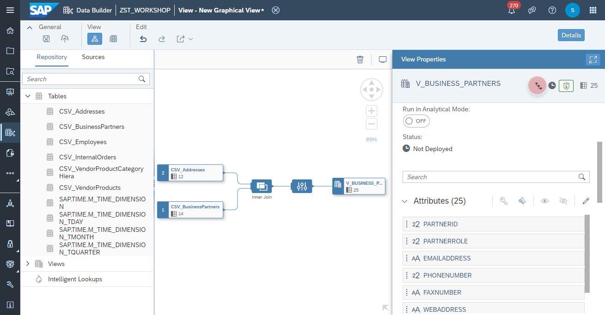
14. Add a new **Level Based Hierarchy**  
   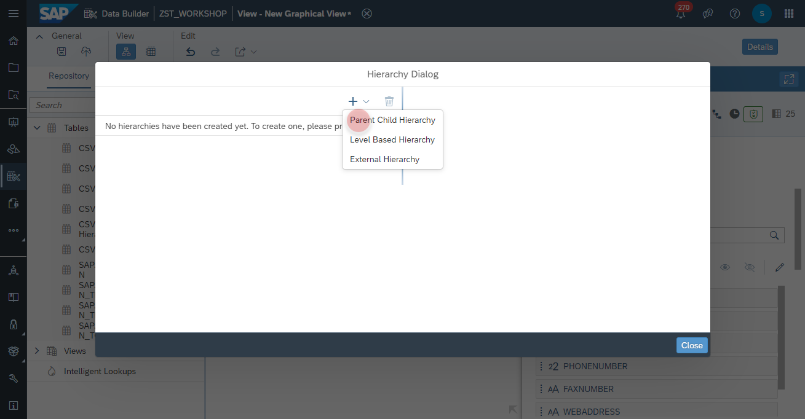
  
15. Adjust the Hierarchy as following: 
   - Business Name: <b>Hierarchy</b>
   - Technical Name: <b>Hierarchy</b>
   - Levels: 
      - **REGION**
      - **COUNTRY**
      - **CITY**
    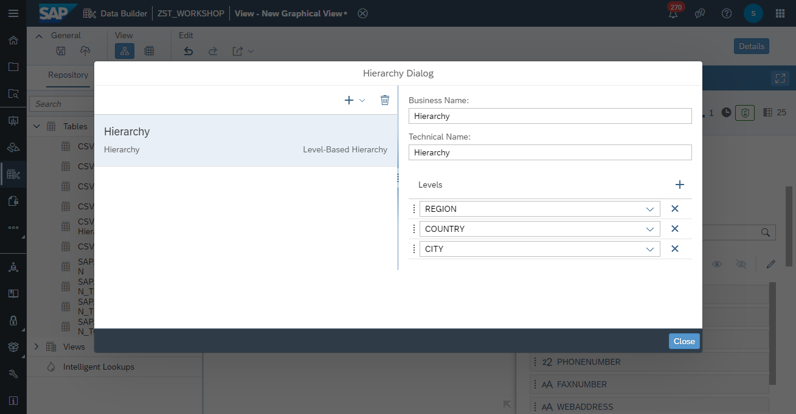
### Data Preview
16. Select the *Output Node* and click on **Data Preview** from the context menu.
    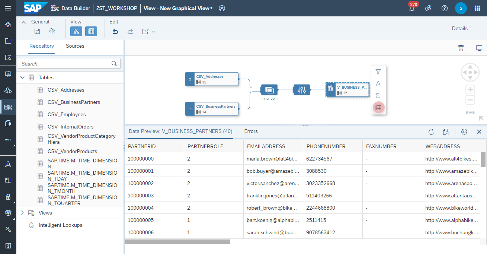
  
### Deployment
17. Click on <b>Deploy</b> button to deploy the view
    
