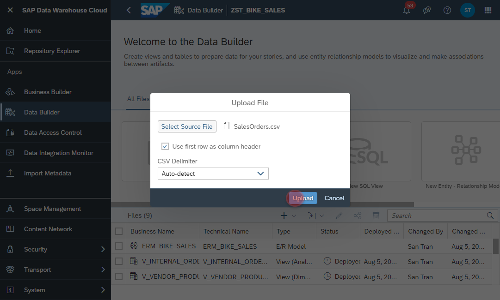

# Upload <i>SFLIGHT</i> CSV Files

##Download the sample dataset via the following link:
https://github.com/d031182/reference-data-model-samples/tree/main/data/SFLIGHT
    - Make sure the following fiiles are available (last update 30th August 2021):
        - TCURR.csv
        - TCURF.csv
        - TCURV.csv
        - TCURX.csv
        - SFLIGHT.csv

       

## Upload <i>TCURR.csv</i>

        
1. Navigate to the Data Builder of SAP Data Warehouse Cloud
2. Click on the <b><i>Import CSV File</i></b>
    
  
  
3. Click on Upload
    
  
  
  

## Upload <i>TCURF.csv</i>
  
  

## Upload <i>TCURV.csv</i>
  
  
        
        
## Upload <i>TCURX.csv</i>
  
  
