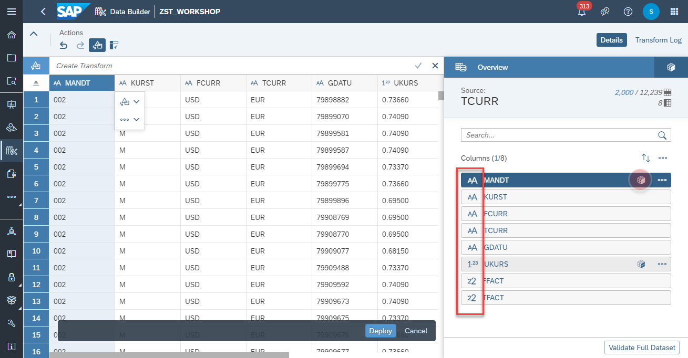
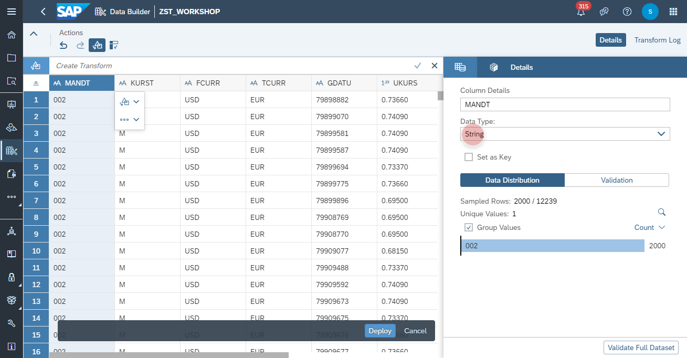
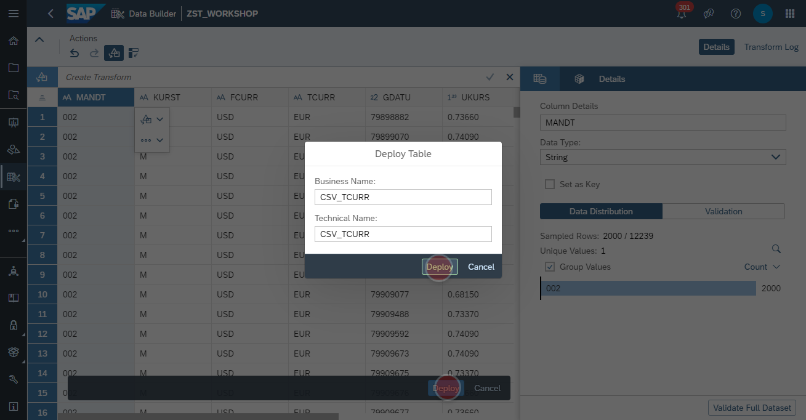
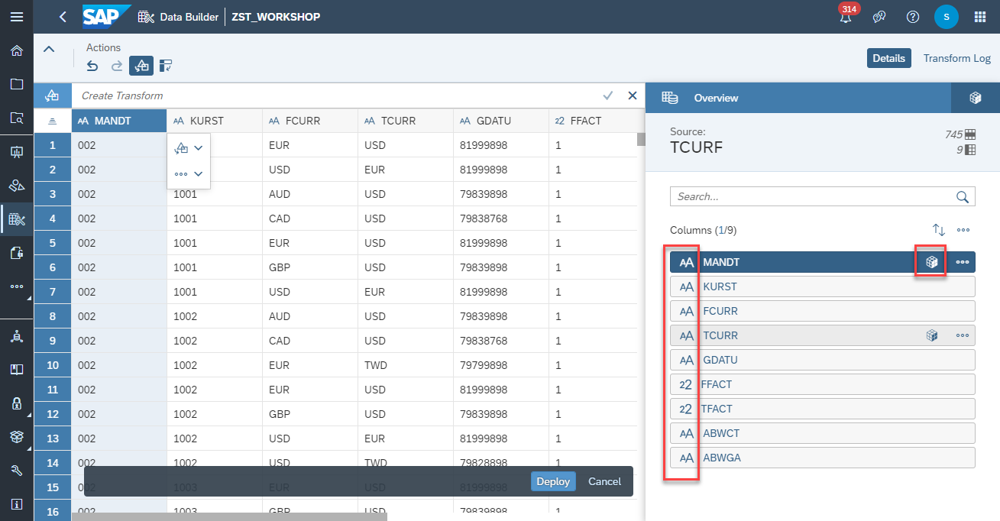
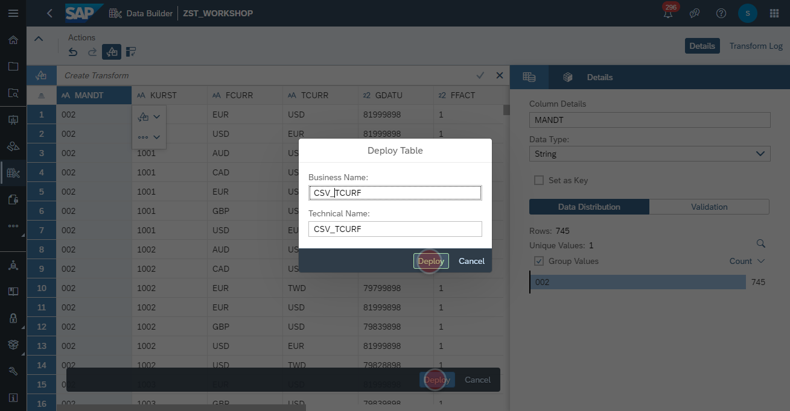
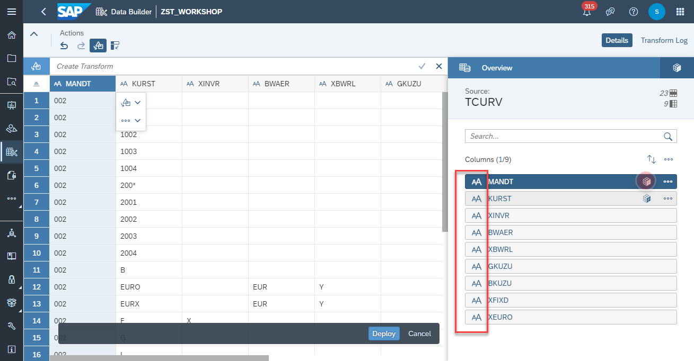
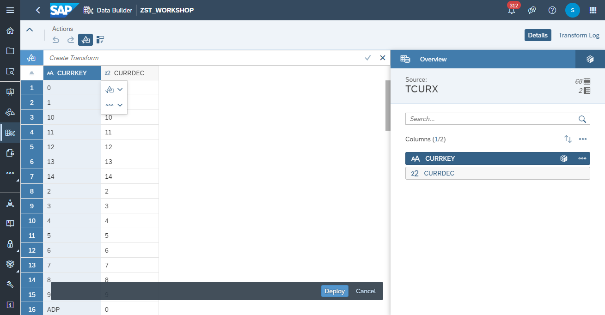
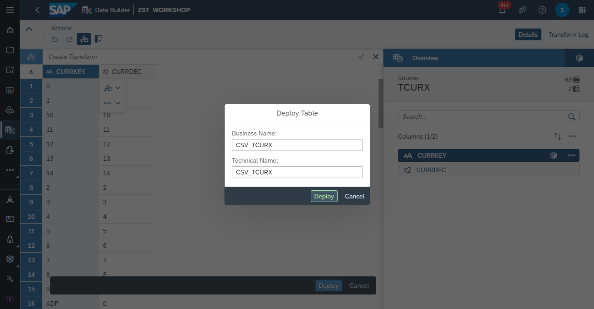

# Upload <i>SFLIGHT</i> CSV Files

## Download the sample dataset:
- Download the sample dataset via the following link: https://github.com/d031182/reference-data-model-samples/tree/main/data/SFLIGHT
- Make sure the following fiiles are available (last update 30th August 2021):
    - TCURR.csv (Currency Rates)
    - TCURF.csv (Currency Prefactors)
    - TCURV.csv (Currency Configurations)
    - TCURX.csv (Currency Precisions)
    - SFLIGHT.csv (Flight Sample Dataset)

       

## Upload file for Currency Rates
1. Navigate to the Data Builder of SAP Data Warehouse Cloud
2. Click on the <b><i>Import CSV File</i></b>
   
3. Select the <i><b>TCURR.csv</b></i> as source file and click on Upload
   
4. Adjust the column data types as the following:

    Column | Data Type
    ---------|---------
    MANDT | String
    KURST | String
    FCURR | String
    TCURR | String
    GDATU | String
    UKURS | Number
    FFACT | Integer
    TFACT | Integer
    
      
      
    
5. Click on Deploy to upload the file and create local table with the Business Name and Technical Name <b><i>CSV_TCURR</i></b>
      

## Upload file for Currency Prefactors
1. Navigate to the Data Builder of SAP Data Warehouse Cloud
2. Click on the <b><i>Import CSV File</i></b>
   
3. Select the <i><b>TCURF.csv</b></i> as source file and click on Upload
   
4. Adjust the column data types as the following:

    Column | Data Type
    ---------|---------
    MANDT | String
    KURST | String
    TCURR | String
    GDATU | String
    FFACT | Integer
    ABWCT | String
    ABWGA | String

      
      

5. Click on Deploy to upload the file and create local table with the Business Name and Technical Name <b><i>CSV_TCURF</i></b>
      

## Upload file for Currency Configuration
1. Navigate to the Data Builder of SAP Data Warehouse Cloud
2. Click on the <b><i>Import CSV File</i></b>
   
3. Select the <i><b>TCURV.csv</b></i> as source file and click on Upload
   
4. Adjust the column data types as the following:

    Column | Data Type
    ---------|---------
    MANDT | String
    KURST | String
    XINVR | String
    BWAER | String
    XBWRL | String
    GKUZU | String
    BKUZU | String
    XFIXD | String
    XEURO | String
    
      
      

5. Click on Deploy to upload the file and create local table with the Business Name and Technical Name <b><i>CSV_TCURV</i></b>
      
        
## Upload file for Currency Precisions
1. Navigate to the Data Builder of SAP Data Warehouse Cloud
2. Click on the <b><i>Import CSV File</i></b>
   
3. Select the <i><b>TCURX.csv</b></i> as source file and click on Upload
   
4. Adjust the column data types as the following:

    Column | Data Type
    ---------|---------
    MANDT | String
    KURST | String
    XINVR | String
    BWAER | String
    XBWRL | String
    GKUZU | String
    BKUZU | String
    XFIXD | String
    XEURO | String
    
      
      

5. Click on Deploy to upload the file and create local table with the Business Name and Technical Name <b><i>CSV_TCURX</i></b>
      
