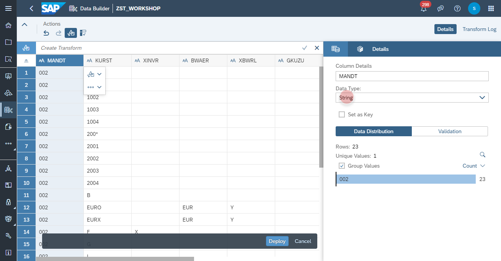

# Upload <i>SFLIGHT</i> CSV Files

## Download the sample dataset:
- Download the sample dataset via the following link: https://github.com/d031182/reference-data-model-samples/tree/main/data/SFLIGHT
- Make sure the following fiiles are available (last update 30th August 2021):
    - TCURR.csv (Currency Rates)
    - TCURF.csv (Currency Prefactors)
    - TCURV.csv (Currency Configurations)
    - TCURX.csv (Currency Precisions)
    - SFLIGHT.csv (Flight Sample Dataset)

       

## Upload Currency Rates
1. Navigate to the Data Builder of SAP Data Warehouse Cloud
2. Click on the <b><i>Import CSV File</i></b>
   
3. Select the <i><b>TCURR.csv</b></i> as source file and click on Upload
   
  
  
  

## Upload <i>TCURF.csv</i> for Currency Prefactors
  
  

## Upload <i>TCURV.csv</i> for Currency Configuration
  
  
        
        
## Upload <i>TCURX.csv</i> for Currency Precisions
  
  
