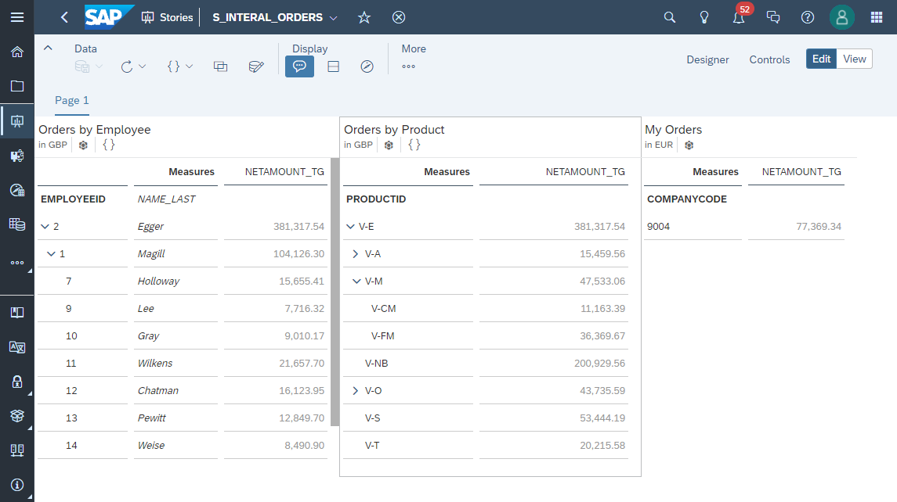

# Exercise 3 - Internal Orders

- [**Exercise 3.1 - Create Employee View**](/exercises/ex3/employees-view)
   - Parent Child Hierarchy (Internal)
- [**Exercise 3.2 - Create Vendor Products View**](/exercises/ex3/vendor-products-view)
   - [Exercise 3.2.1 - Create Parent-Child Hierarchy View](/exercises/ex3/vendor-product-category-hierarchy-view)
   - [Exercise 3.2.2 - Create Hierarchy Association](/exercises/ex3/vendor-products-hierarchy-association)
- [**Exercise 3.3 - Create Internal Orders View**](/exercises/ex3/internal-orders-view)
   - [Exercise 3.3.1 - Wrap Currency Tables as Views](/exercises/ex3/currency-wrapper-view)
   - [Exercise 3.3.2 - Calculation Node with Currency Conversion](/exercises/ex3/internal-orders-currency-conversion)
   - [Exercise 3.3.3 - Input Parameters](/exercises/ex3/internal-orders-input-parameter)
- [**Exercise 3.4 - Create My Orders View**](/exercises/ex3/my-orders-view)
   - [Exercise 3.4.1 - Create Data Access Control](/exercises/ex3/data-access-control)
   - [Exercise 3.4.2 - Use Data Access Control](/exercises/ex3/my-orders-dac)
   - [Exercise 3.4.3 - Maintain Data for a Data Access Control](/exercises/ex3/maintain-dac-data)
   - [Exercise 3.4.4 - SAC Story Filter](/exercises/ex3/my-orders-sac-story-filter)
- [**Exercise 3.5 - Create Internal Orders Story in SAP Analytics Cloud**](/exercises/ex3/internal-orders-story)

 
 

