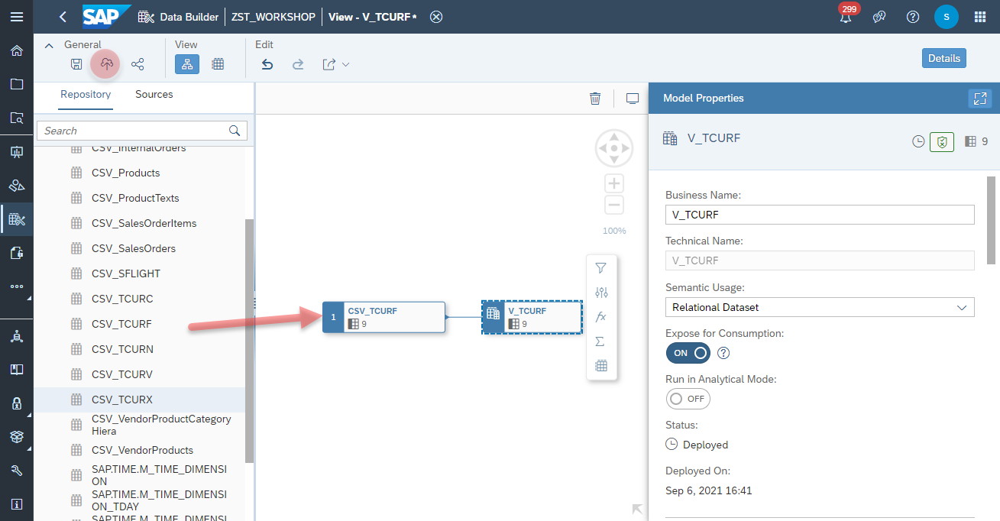
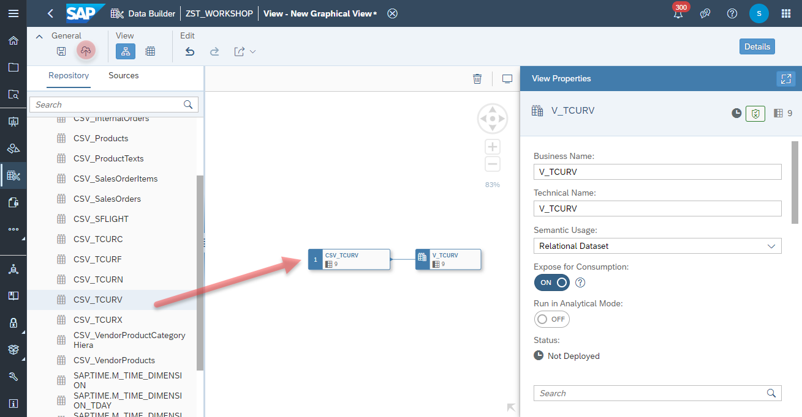
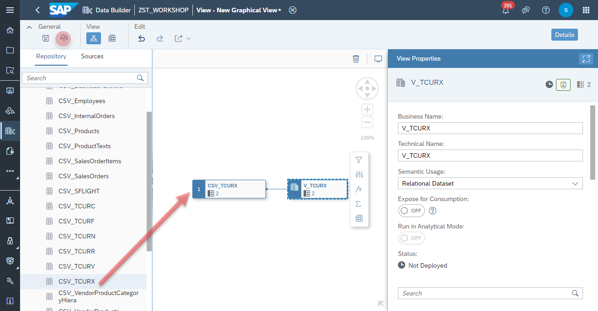

# Wrap Currency (TCUR*) Tables  as Views

In the exercise you will wrap the Currency Tables as Views, which can be used in the Currency Conversion function in the modeling as the following:

```javascript
CONVERT_CURRENCY(
  "AMOUNT" => "NETAMOUNT", 
  "SOURCE_UNIT" => "CURRENCY", 
  "TARGET_UNIT" => 'EUR', 
  "CONVERSION_TYPE" => 'M', 
  "REFERENCE_DATE" => CURRENT_DATE, 
  "CLIENT" => '002', "SCHEMA" => 'ZST_WORKSHOP', 
  "ERROR_HANDLING" => 'set_to_null', 
  "STEPS" => 'shift,convert,round', 
  "PRECISIONS_TABLE" => 'V_TCURX', 
  "CONFIGURATION_TABLE" => 'V_TCURV', 
  "PREFACTORS_TABLE" => 'V_TCURF', 
  "RATES_TABLE" => 'V_TCURR'
  "NOTATION_TABLE" => 'V_TCURN')
```
>:mortar_board: **CONVERT_CURRENCY() Function**: More information about the SAP HANA Function and the configuration of the parameters can be found under the [SAP Help site](https://help.sap.com/viewer/7c78579ce9b14a669c1f3295b0d8ca16/Cloud/en-US/d22d746ed2951014bb7fb0114ffdaf96.html).

>:triangular_flag_on_post: **2021-09-22**:
>As of today, SAP Analytics Cloud must not access any table directly in SAP Data Warehouse Cloud due to security boundaries. That applies also for the currency conversion relevant tables such as **TUCRR (Rates)**, **TCURX (Precisions)**, **TCURV (Configurations)**, **TCURF (Prefactors)**, **TCURN (Notation)**.
>
>As an intermediate workaround you have to wrap the tables as views and declare them in the usage of the Currency Conversion function.
>**Please note that this will change in the upcomming releases**. There it is planned that Currency Conversion can be configured centrally per space. 


## Wrap <i>Currency Rates</i> (TCURR) Table as View

1. Navigate to the Repository Explorer
2. Click on <b><i>Create - Graphical View</i></b> Button to create a new view
  <br><br><br><br>
3. Drag and drop the table <b><i>CSV_TCURR</i></b> into the canvas
  <br><br><br><br>
4. Select the Output Node in the canvas and configure the following properties:
    - Business Name: <b>V_TCURR</b>
    - Technical Name: <b>V_TCURR</b>
    - Semantic Usage: <b>Relational Dataset</b>
    - Expose for Consumption: <b>ON</b>
 5. Click on <b><i>deploy</i></b> button to deploy the view

## Wrap <i>Currency Prefactors</i> (TCURF) Table as View

1. Navigate to the Repository Explorer
2. Click on <b><i>Create - Graphical View</i></b> Button to create a new view
  <br><br><br><br>
3. Drag and drop the table <b><i>CSV_TCURF</i></b> into the canvas
  <br><br><br><br>
4. Select the Output Node in the canvas and configure the following properties:
    - Business Name: <b>V_TCURF</b>
    - Technical Name: <b>V_TCURF</b>
    - Semantic Usage: <b>Relational Dataset</b>
    - Expose for Consumption: <b>ON</b>
 5. Click on <b><i>deploy</i></b> button to deploy the view


## Wrap <i>Currency Configurations</i> (TCURV) Table as View

1. Navigate to the Repository Explorer
2. Click on <b><i>Create - Graphical View</i></b> Button to create a new view
  <br><br><br><br>
3. Drag and drop the table <b><i>CSV_TCURV</i></b> into the canvas
  <br><br><br><br>
4. Select the Output Node in the canvas and configure the following properties:
    - Business Name: <b>V_TCURV</b>
    - Technical Name: <b>V_TCURV</b>
    - Semantic Usage: <b>Relational Dataset</b>
    - Expose for Consumption: <b>ON</b>
 5. Click on <b><i>deploy</i></b> button to deploy the view

## Wrap <i>Currency Configurations</i> (TCURX) Table as View

1. Navigate to the Repository Explorer
2. Click on <b><i>Create - Graphical View</i></b> Button to create a new view
  <br><br><br><br>
3. Drag and drop the table <b><i>CSV_TCURX</i></b> into the canvas
  <br><br><br><br>
4. Select the Output Node in the canvas and configure the following properties:
    - Business Name: <b>V_TCURX</b>
    - Technical Name: <b>V_TCURX</b>
    - Semantic Usage: <b>Relational Dataset</b>
    - Expose for Consumption: <b>ON</b>
 5. Click on <b><i>deploy</i></b> button to deploy the view


