# Create Input Parameters

1. Navigate to the Repository Explorer
2. Search and open the view **V_INTERNAL_ORDERS** Button to create a new view
  <br><br>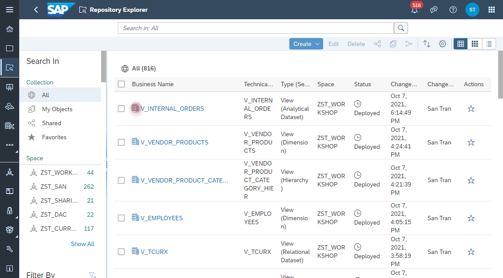<br><br>
3. Select the _Output Node_ and click on the **Edit** button in the _Input Parameter_ section.
  <br><br>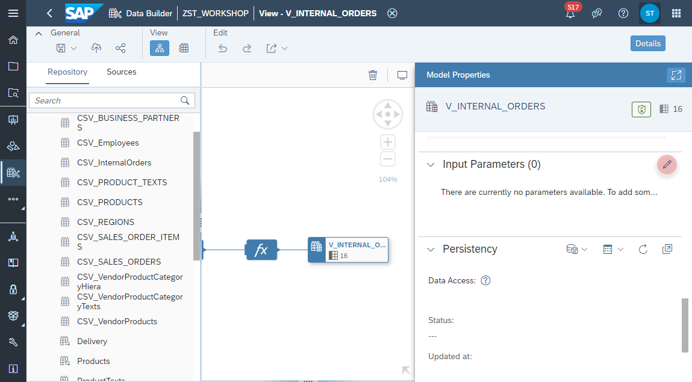
4. Add a new Input Parameter with the following properties:
    - Business Name: **IP_TARGET_CURRENCY**
    - Technical Name: **IP_TARGET_CURRENCY**
    - Data Type: **String**
    - Length: **3**
    
    <br>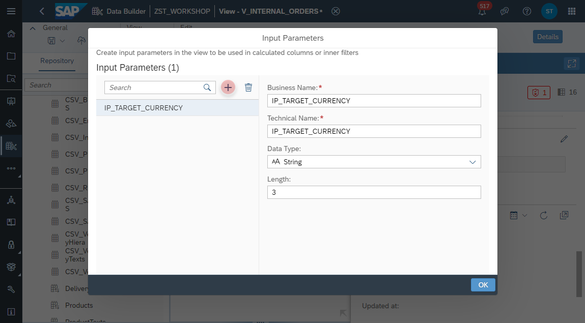

5. Select the _Calculation Node_ and edit the column **NETAMOUNT_TG**
  <br><br>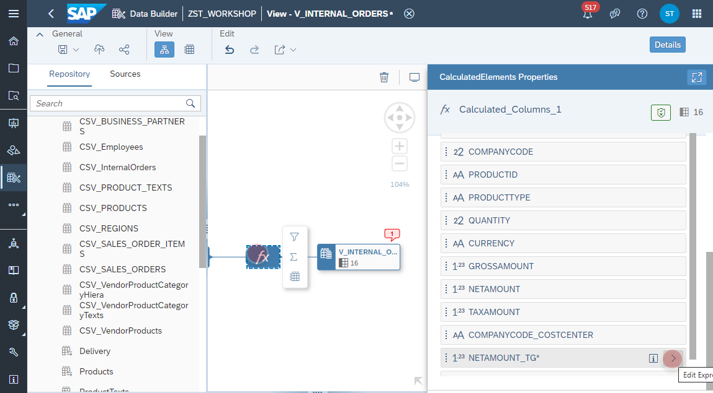

6. In the _Calculation Expression_ replace in the _CONVERT_CURRENCY()_ function the 'EUR' with the input parameter **:IP_TARGET_CURRENCY**
  <br><br>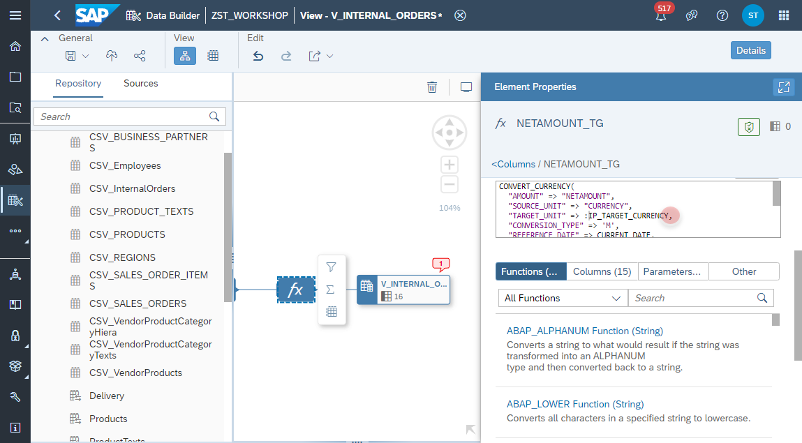
  
<br><br>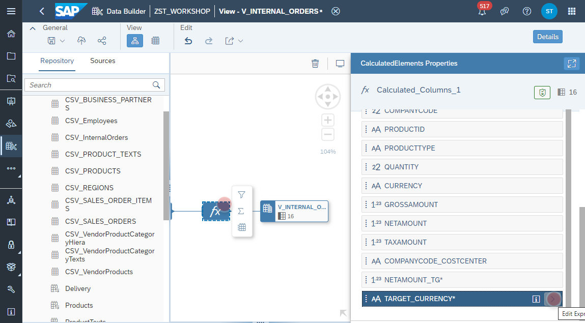
<br><br>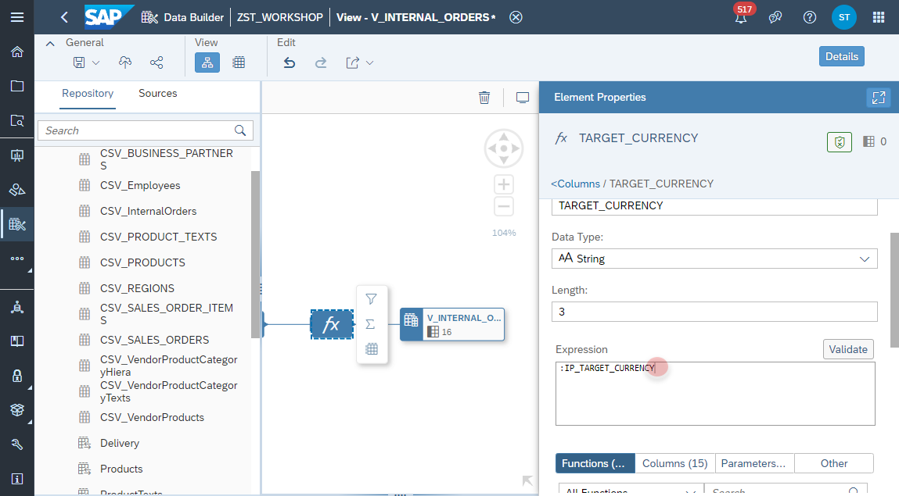
<br><br>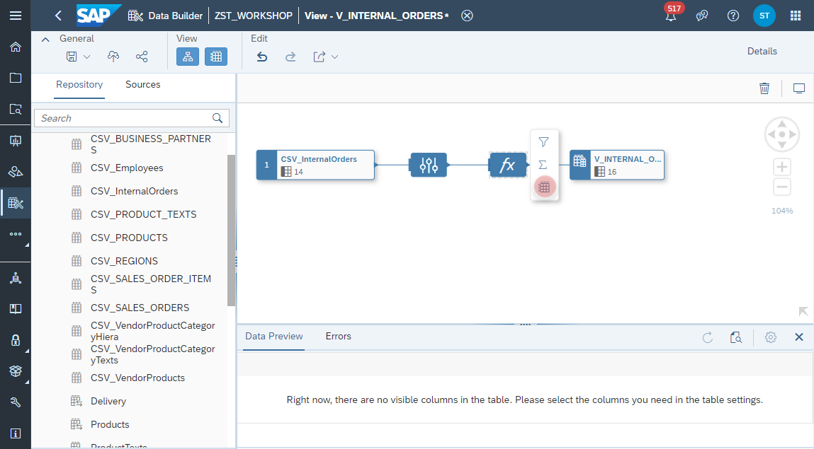
<br><br>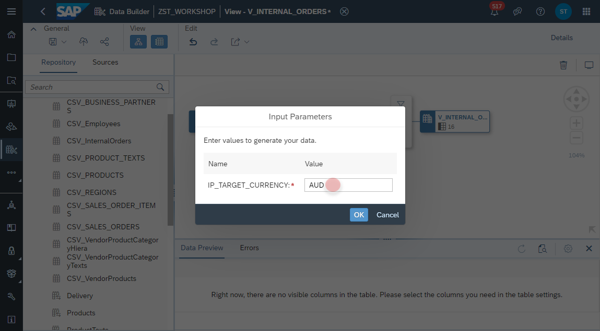
<br><br>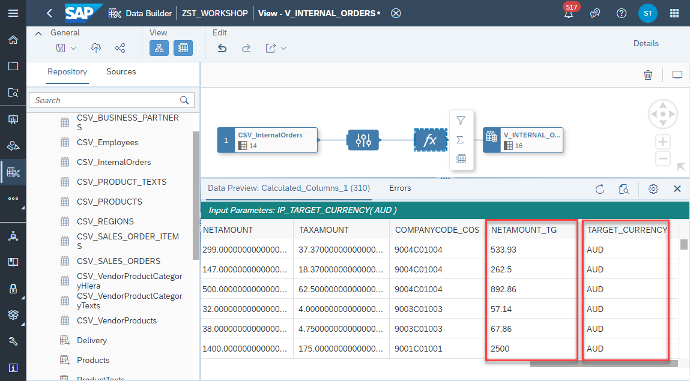

4. Select the Calculation Node and add a new <b>Calculated Column</b>.
<br><br>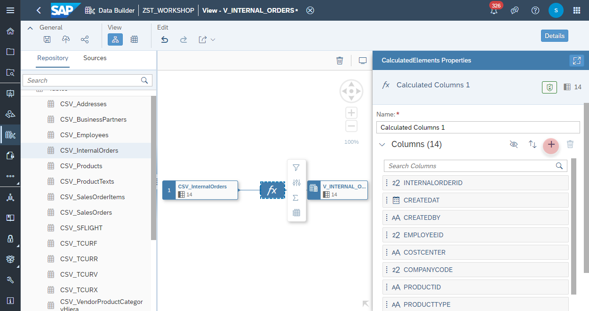

5. Configure the Calculated Column as the following:
    - Business Name: <b>TARGET_CURRENCY</b>
    - Technical Name: <b>TARGET_CURRENCY</b>
    - Data Type: <b>Double</b>
    - Length: <b>3</b>
    - Expression: <b>'EUR'</b>
    <br><br>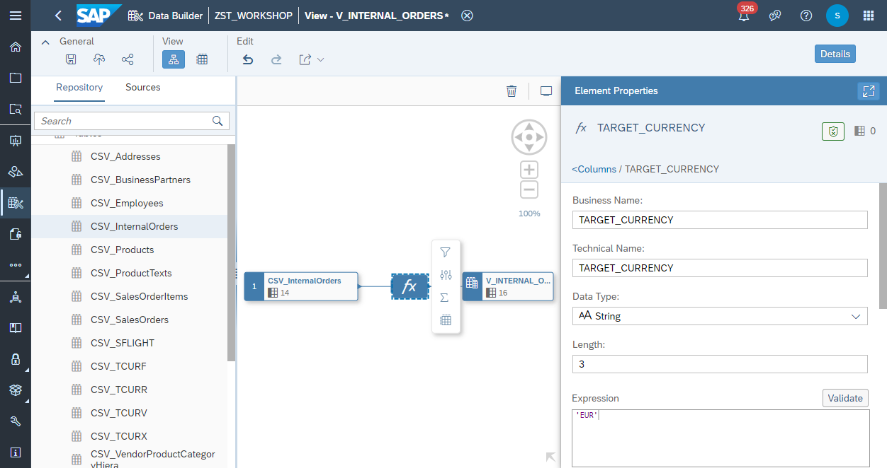

6. Select the Calculation Node and add another <b>Calculated Column</b>.
  <br><br>

7. Configure the Calculated Column as the following:
  - Business Name: <b>NETAMOUNT_TG</b>
  - Technical Name: <b>NETAMOUNT_TG</b>
  - Data Type: <b>Double</b>
  - Length: <b>3</b>
  - Expression: 
  
    ```javascript
    CONVERT_CURRENCY(
      "AMOUNT" => "NETAMOUNT", 
      "SOURCE_UNIT" => "CURRENCY", 
      "TARGET_UNIT" => 'EUR', 
      "CONVERSION_TYPE" => 'M', 
      "REFERENCE_DATE" => CURRENT_DATE, 
      "CLIENT" => '002', "SCHEMA" => 'ZST_WORKSHOP', 
      "ERROR_HANDLING" => 'set_to_null', 
      "STEPS" => 'shift,convert,round', 
      "PRECISIONS_TABLE" => 'V_TCURX', 
      "CONFIGURATION_TABLE" => 'V_TCURV', 
      "PREFACTORS_TABLE" => 'V_TCURF', 
      "RATES_TABLE" => 'V_TCURR')
    ```
    
  >🎓 **CONVERT_CURRENCY() Function**: More information about the SAP HANA Function and the configuration of the parameters can be found under the [SAP Help site](https://help.sap.com/viewer/7c78579ce9b14a669c1f3295b0d8ca16/Cloud/en-US/d22d746ed2951014bb7fb0114ffdaf96.html). 


  <br>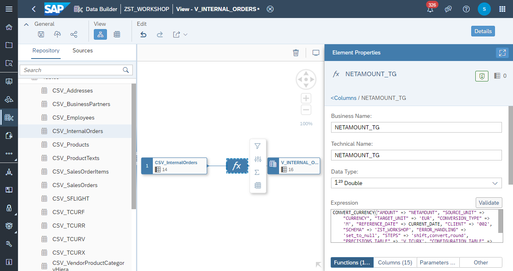
      
    
8. Select the Calculation Node and click on <b>Data Preview</b> from the context menu.
    - Validate the values in <b>NETAMOUNT_TG</b> and <b>TARGET_CURRENCY</b>
    - Compare the values between <b>NETAMOUNT</b> and <b>NETAMOUNT_TG</b>
      <br><br>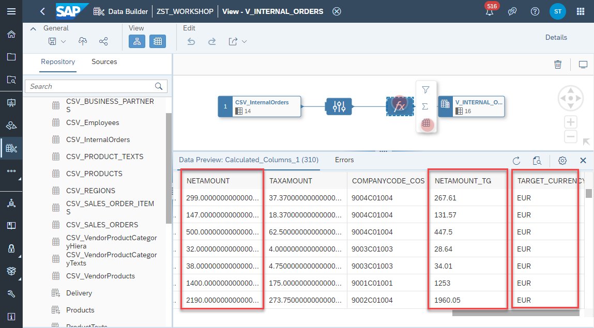

9. Click on <b><i>deploy</i></b> button to deploy the view
<br><br>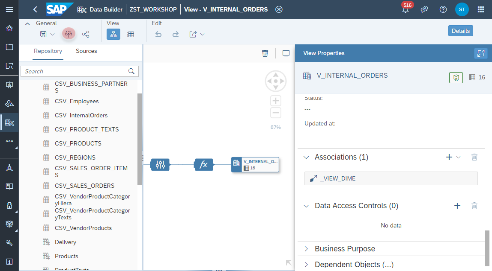
