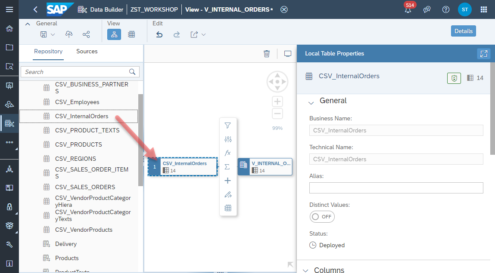
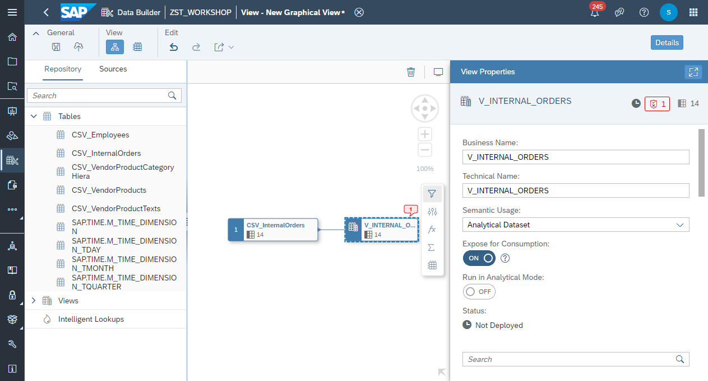
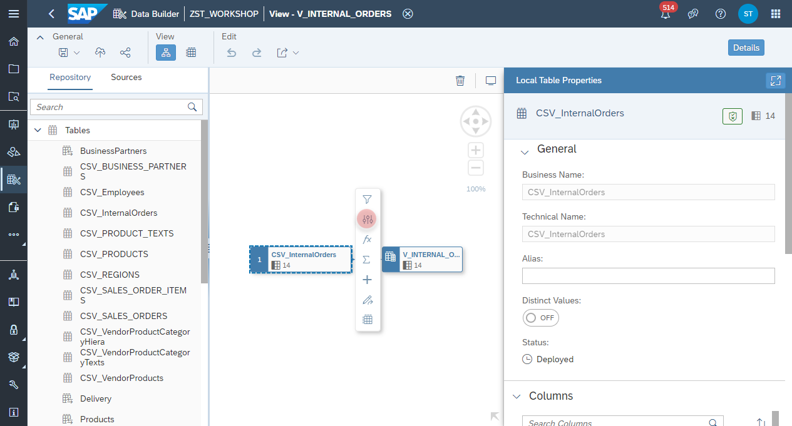
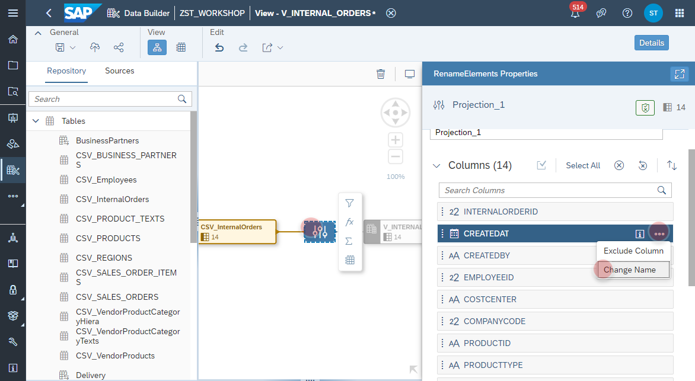
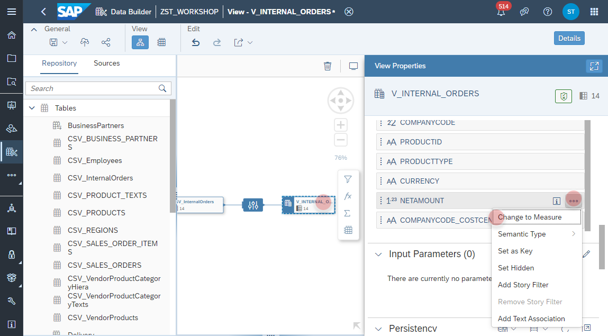
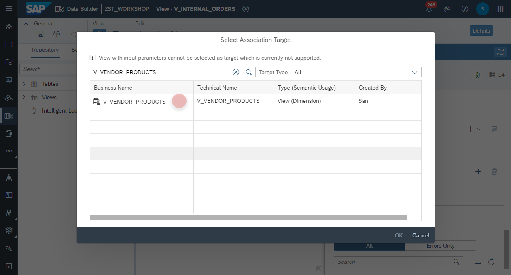
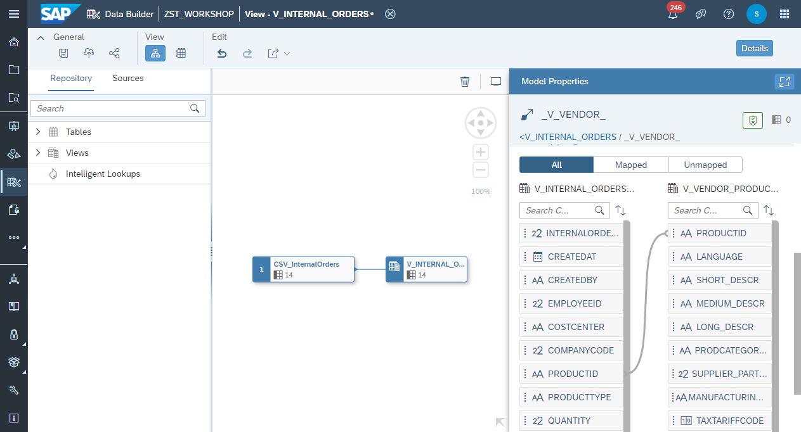
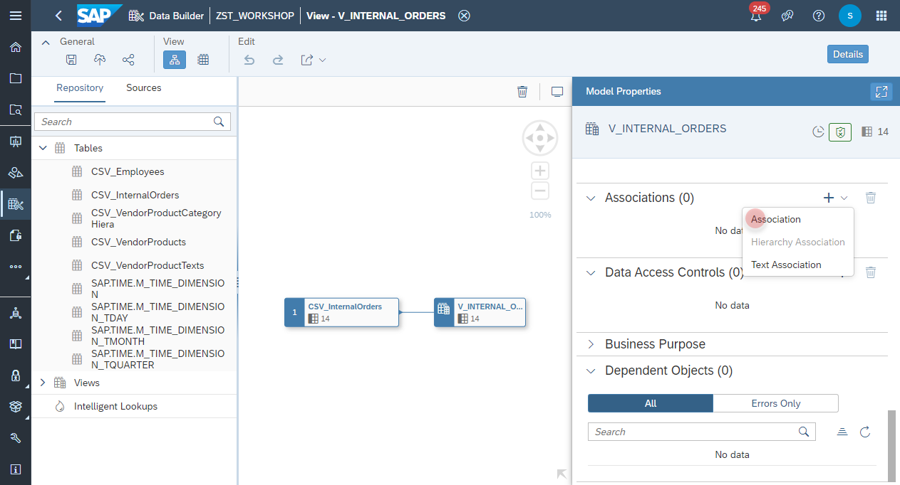
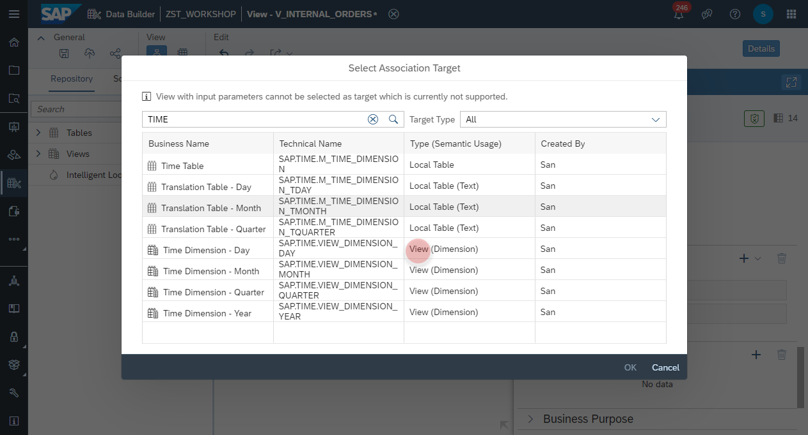
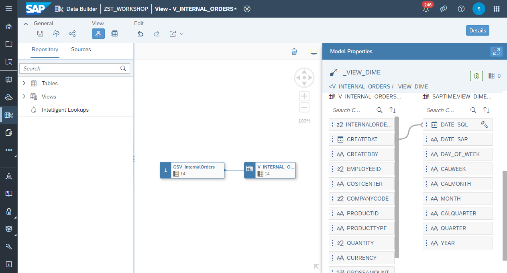

# Create Internal Orders View

1. Navigate to the Repository Explorer
2. Click on <b><i>Create - Graphical View</i></b> Button to create a new view
      
3. Drag and drop the table <b><i>CSV_VendorProductCategoryHierarchy</i></b> into the canvas
    
4. Select the Output Node in the canvas and configure the following properties:
    - Business Name: <b>V_INTERNAL_ORDERS</b>
    - Technical Name: <b>V_INTERNAL_ORDERS</b>
    - Semantic Usage: <b>Analytical Dataset</b>
    - Expose for Consumption: <b>ON</b>
      

5. Select the <i>Output Node</i> and change the following columns into measures:<b>
  - NETAMOUNT
  - GROSSAMOUNT
  - TAXAMOUNT
  - QUANTITY</b>
    

6. Click on the **CSV_InternalOrders Node** and add a **Projection Node** from the context menu.
    
  
7. Select the column **CREATEDAT** from the **Projection Node** and click on **Change Name**.
    

8. Change the name of the column to **CREATE_DATE**.
    

### Create Associations
5. Select the <i>Output</i> node in the canvas and add a new association from the <i>Associations</i> section: 
  
6. Find a select the view <b>V_VENDOR_PRODUCTS</b>
  

7. Map the column <b>V_INTERNAL_ORDERS.PRODUCTID</b> with the column <b>V_VENDOR_PRODUCTS.PRODUCTID</b>
  

8. Select the <i>Output</i> node in the canvas and add a new association from the <i>Associations</i> section: 
  

9. Find a select the view <b>V_EMPLOYEES</b>
  

10. Map the column <b>V_INTERNAL_ORDERS.EMPLOYEEID</b> with the column <b>V_EMPLOYEES.EMPLOYEEID</b>
  

11. Select the <i>Output</i> node in the canvas and add a new association from the <i>Associations</i> section: 
  

12. Find a select the view <b>SAP.TIME.VIEW_DIMENSION_DAY (Time Dimension-Day)</b>
  

13. Map the column <b>V_INTERNAL_ORDERS.CREATEDAT</b> with the column <b>SAP.TIME.VIEW_DIMENSION_DAY.DATE_SQL</b>
  

### Deploy
15. Click on <b><i>deploy</i></b> button to deploy the view
  
 
