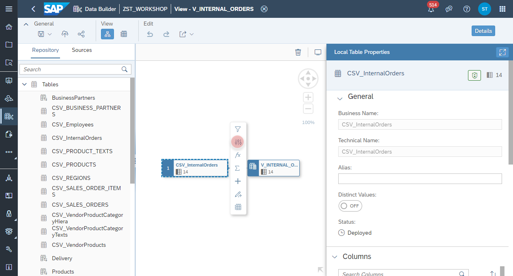
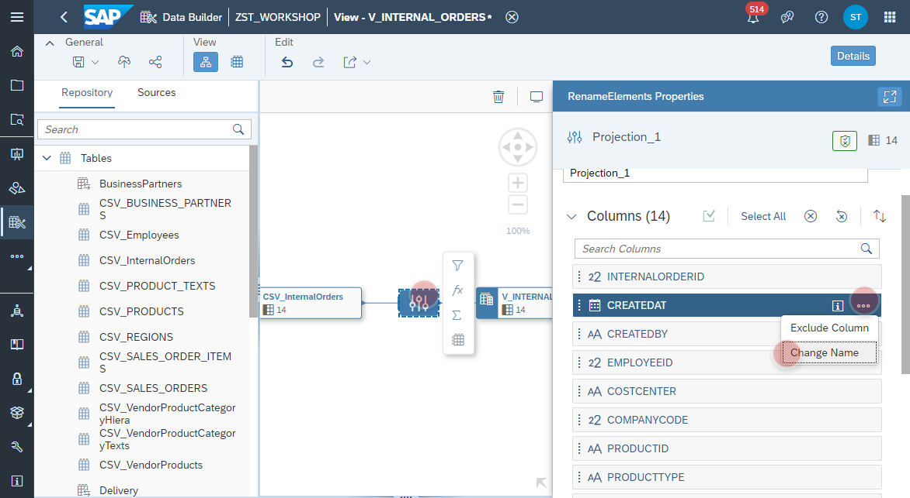
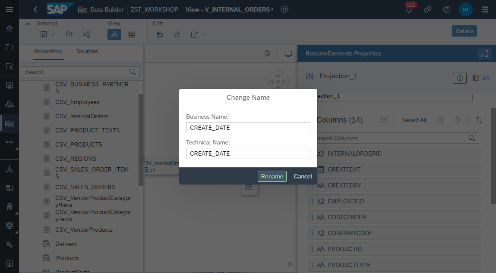
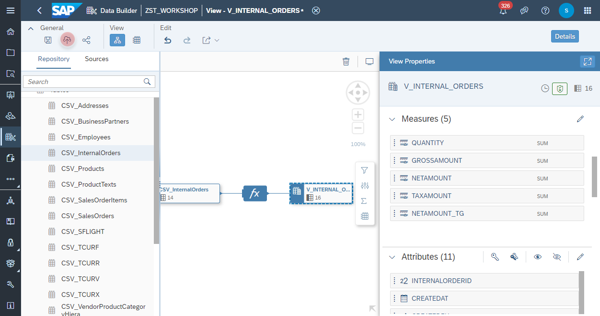
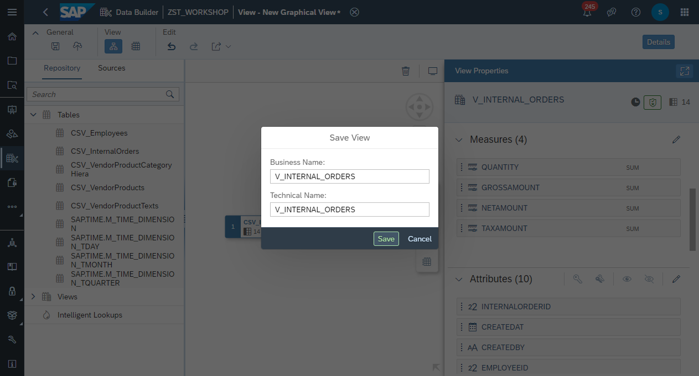
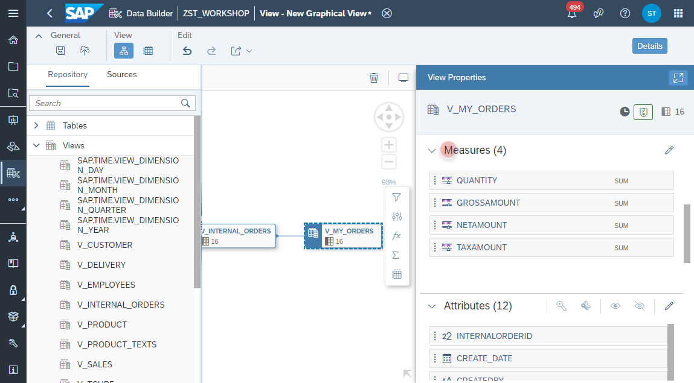
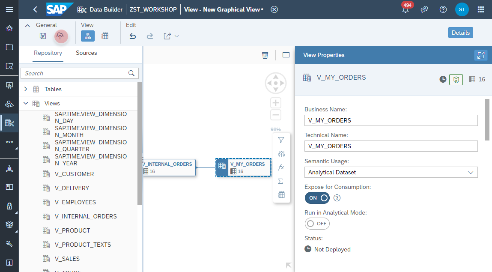

 # Create Internal Orders View

1. Navigate to the Repository Explorer
2. Click on <b><i>Create - Graphical View</i></b> Button to create a new view
      
3. Drag and drop the table **_CSV_InternalOrders_** into the canvas.
    

4. Select the Output Node in the canvas and configure the following properties:
  - Business Name: <b>V_INTERNAL_ORDERS</b>
  - Technical Name: <b>V_INTERNAL_ORDERS</b>
  - Semantic Usage: <b>Analytical Dataset</b>
  - Expose for Consumption: <b>ON</b>
    
    
    
    
    
    
    
  

   
 
   
  
  
6. Click on the **Deploy** button to deploy the view.
    

  

  
