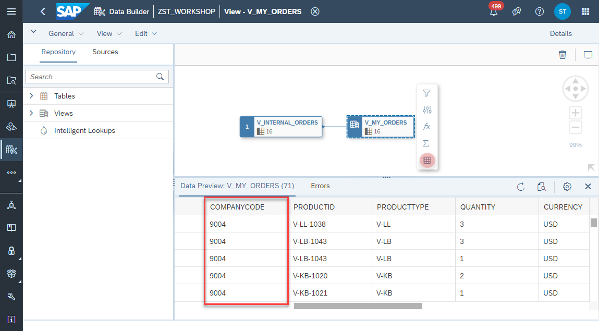

# SAP Analytics Cloud Story Filter

1. Navigate to the Repository Explorer
2. Search and open the view _**V_MY_ORDERS**_ 
     
3. Select on the _Output_ Node the Data Preview from the context menu. As a result you should be able to see only data for **Company Code 9004**, which is maintained in the table **T_DAC_DATA**
     
