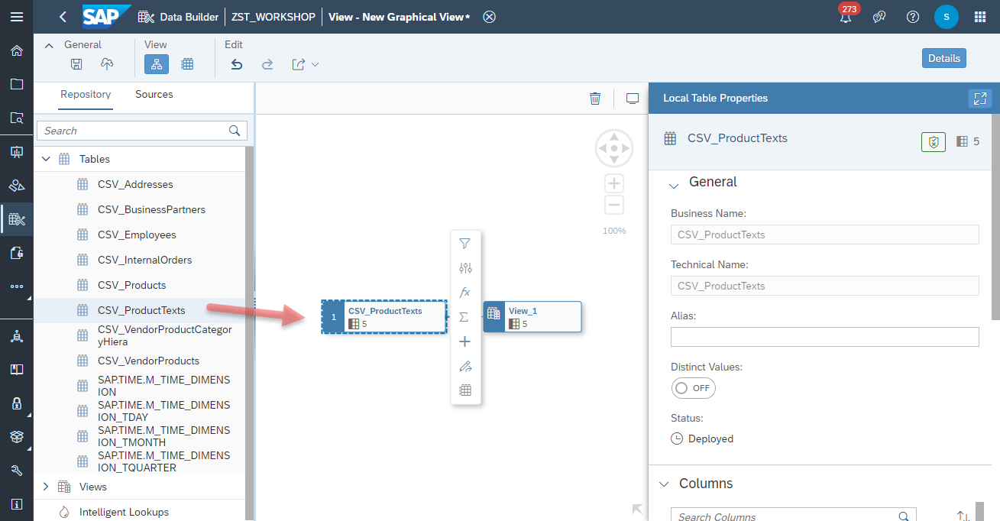
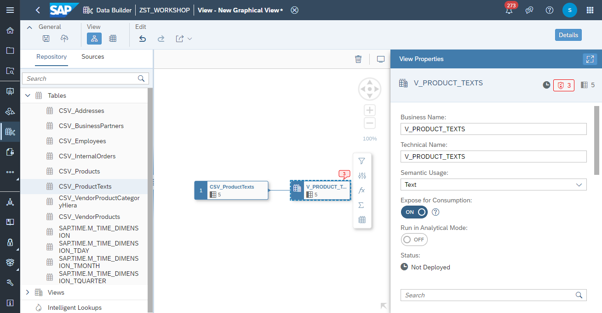

# Create <i>Product Texts</i> View

1. Navigate to the Repository Explorer
2. Click on <b><i>Create - Graphical View</i></b> Button to create a new view
      
3. Drag and drop the table <b><i>CSV_ProductTexts</i></b> into the canvas
    
4. Select the Output Node in the canvas and configure the following properties:
    - Business Name: <b>V_PRODUCT_TEXTS</b>
    - Technical Name: <b>V_PRODUCT_TEXTS</b>
    - Semantic Usage: <b>Text</b>
    - Expose for Consumption: <b>ON</b>
      
 5. Set the <b>primary keys</b> to:
    - <b>PRODUCTID</b>
    - <b>LANGUAGE</b> 
     
     
 6. Click on <b><i>Edit Attributes</i></b> 
      <b>  
 7. Adjust the attributes properties as the following:
    - <b>LANGUAGE</b>: set the semantic usage to <b>Language</b>
    - <b>MEDIUM_DESCR</b>: set the semantic usage to <b>Text</b>
    - <b>PRODUCTID</b>: set label to <b>MEDIUM_DESCR</b>   
     
     
  8. Click on <b><i>deploy</i></b> button to deploy the view
    
