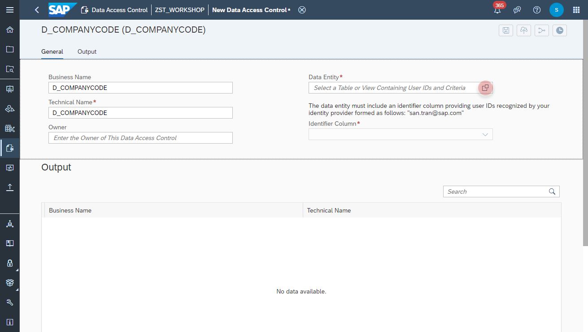

# Create <i>Employees</i> View

1. Navigate to the Repository Explorer
2. Click on _**Create - Local Table**_ Button to create a new view
    
3. Configure the following properties on the **General** section:
    - Business Name: **T_COMPANYCODE_DAC**
    - Technical Name: **T_COMPANYCODE_DAX**
    - Semantic Usage: **Relational Dataset**
    
  
  
    
    
    
    
    
    
    
    
    
  

