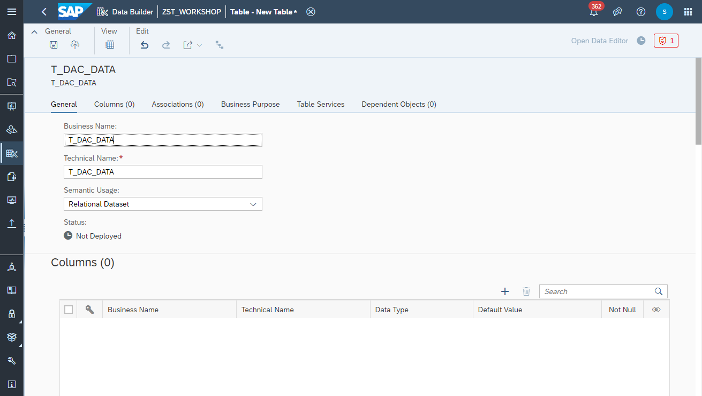

# Create <i>Employees</i> View

1. Navigate to the Repository Explorer
2. Click on <b><i>Create - Graphical View</i></b> Button to create a new view
      
3. Drag and drop the table <b><i>CSV_VendorProductCategoryHierarchy</i></b> into the canvas
    
    
    
    
    
    
    
    
    
    
    
  

