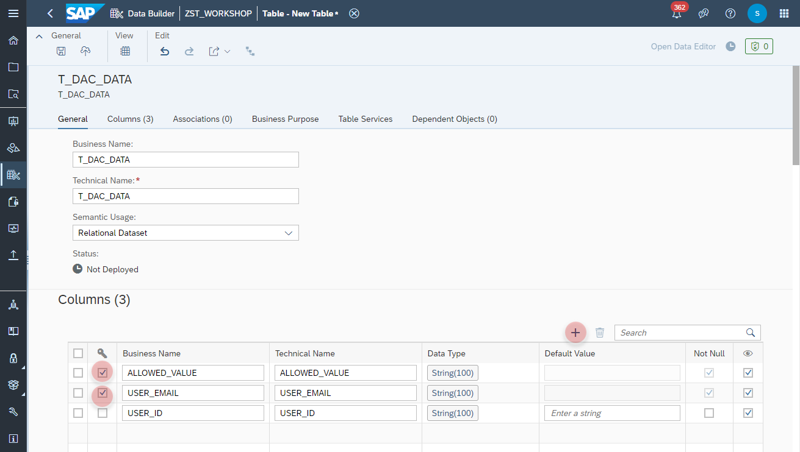

# Create _Company Code_ Data Access Control

In this exercise we will create a **Data Access Control** and apply it on the data models. 
>:blue_book: **Data Access Control**: Using a Data Access Control in SAP Data Warehouse Cloud, you can control and restrict users' data access on specific part of the data model. The Data Access Control acts like a **Lock**, which describes which column will be checked / filtered (e.g. Company Code) during query runtime. Once defined, this lock can be attached on your appropriate models and will trigger each time a validation. Users is able to see only those data for which he has been granted for, e.g. User ABC is granted with authorization for Company Code 9004.
 

## Create Company Code Local Table 
In the first step you define a sourece, which contains the granted authrization value per user.
That could be a 
- Local Table
- Remote Table
- CSV uploaded Table
- View

In this exercise we are going to create a **Local Table**.

1. Navigate to the Repository Explorer
2. Click on _**Create - Local Table**_ Button to create a new view
    
3. Configure the following properties on the **General** section:
    - Business Name: **T_COMPANYCODE_DAC**
    - Technical Name: **T_COMPANYCODE_DAX**
    - Semantic Usage: **Relational Dataset**
    
  
4. Add the following columns in the **Columns** section:
    Primary Key | Column Name | Data Type
    ---|---|---
    Yes | COMAPNYCODE | String (100) 
    Yes | USER_EMAIL | String (100)
    No | USER_ID | String (100)
    
  
5. Click on the **Deploy** button to deploy the table.
    
  
## Maintain the Authorization and Data Access for the User 
1. Click on the **Open Data Editor** button to enter the editing mode of the table:
    
2. Click on the **Add** button to create a new record with the following values:
   COMPANYCODE | USER_EMAIL | USER_ID
   ---|---|---
   9004 | _your email address_ | _your user id_  
    

3. Click on the **Save** button to insert the records into the table.
    
## Create Company Code Data Access Control
    
    
    
    
  

