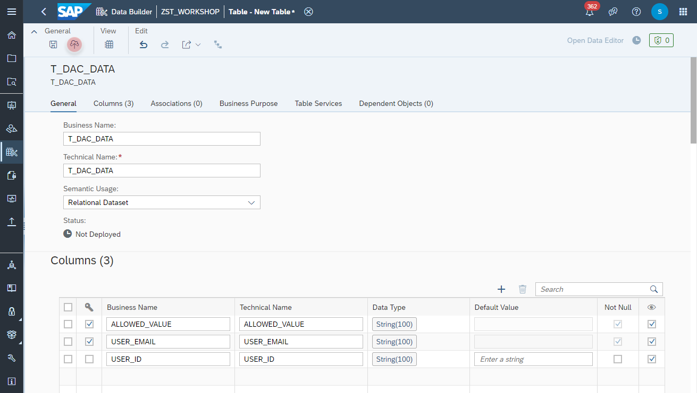
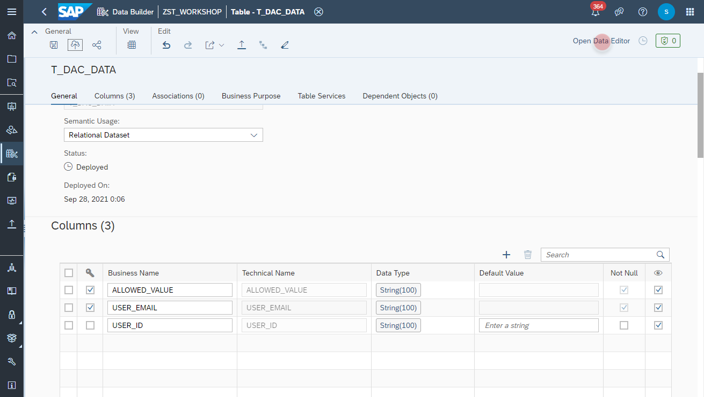
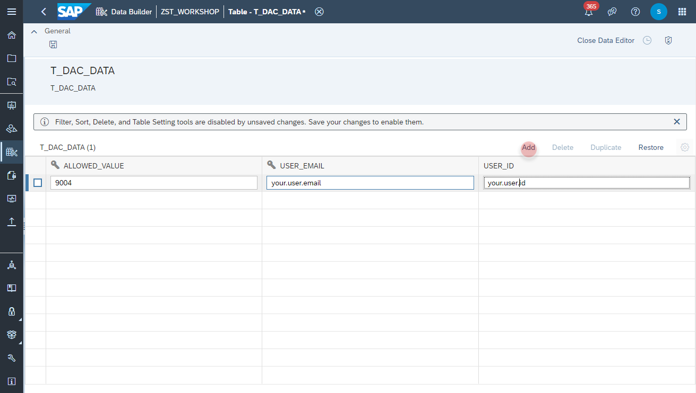
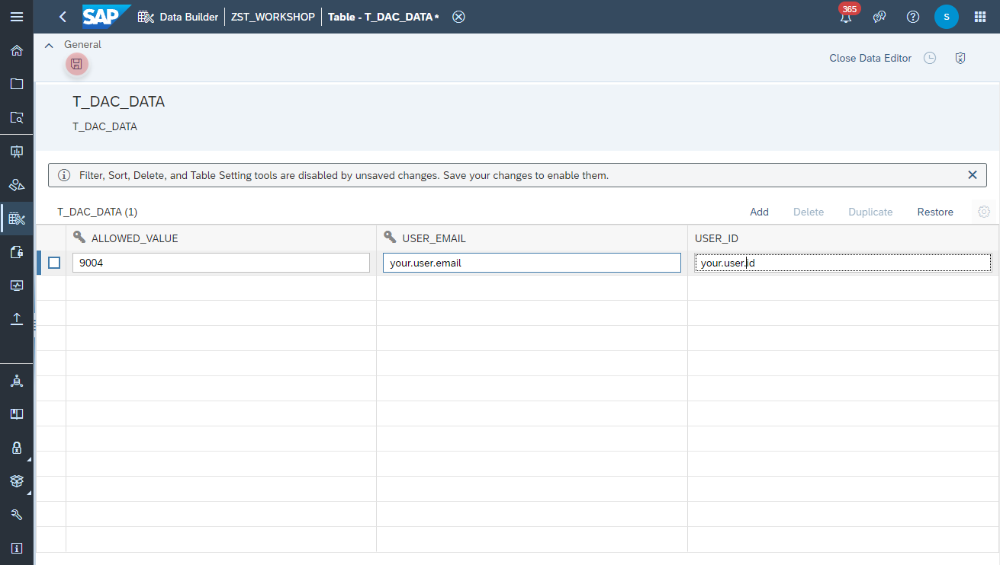

# Create <i>Employees</i> View

## Create Company Code Local Table 

1. Navigate to the Repository Explorer
2. Click on _**Create - Local Table**_ Button to create a new view
    
3. Configure the following properties on the **General** section:
    - Business Name: **T_COMPANYCODE_DAC**
    - Technical Name: **T_COMPANYCODE_DAX**
    - Semantic Usage: **Relational Dataset**
    
  
4. Add the following columns in the **Columns** section:
    Primary Key | Column Name | Data Type
    ---|---|---
    Yes | COMAPNYCODE | String (100) 
    Yes | USER_EMAIL | String (100)
    No | USER_ID | String (100)
    
  
5. Click on the **Deploy** button to deploy the table.
    
  
## Maintain the Authorization and Data Access for the User 
1. Click on the **Open Data Editor** button to enter the editing mode of the table:
    
2. Click on the **Add** button to create a new record with the following values:
   COMPANYCODE | USER_EMAIL | USER_ID
   ---|---|---
   9004 | _your email address_ | _your user id_  
    

3. Click on the **Save** button to insert the records into the table.
    
## Create Company Code Data Access Control
    
    
    
    
  

