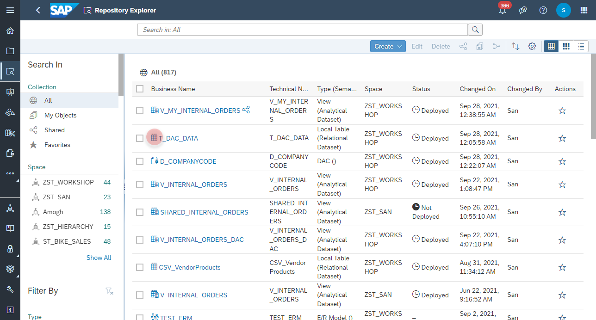
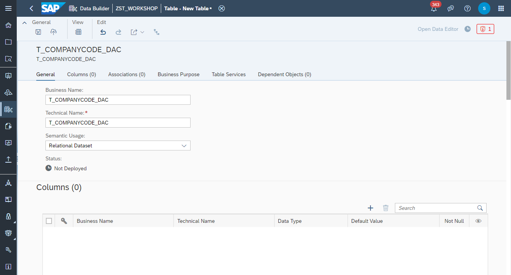
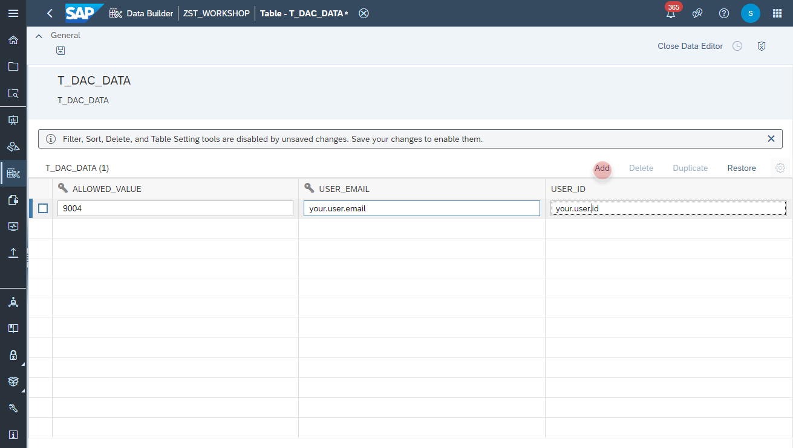
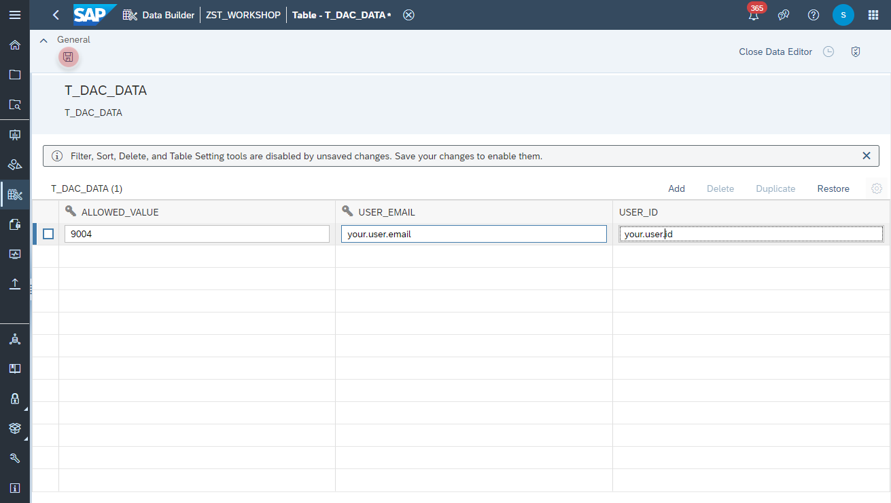
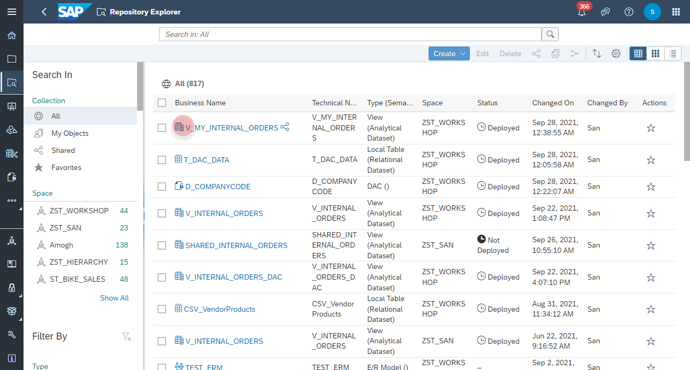
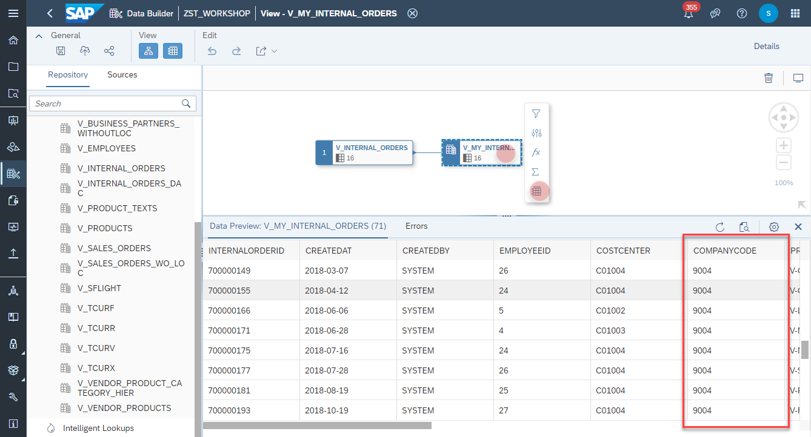

# Maintain Data of Data Access Control

In this exercise we will create a **Data Access Control** and apply it on the data models. 
>:mortar_board: **Data Access Control**: Data access controls allow you to apply row-level security to your objects. When a data access control is applied to a data layer view or a business layer object, any user viewing its data will see only the rows for which they are authorized, based on the specified criteria. The Data Access Control acts like a **Lock**. Once defined, it can be attached to your data models to guard them from unauthorized data access.
>
>For more information please see the [SAP Help site](https://help.sap.com/viewer/c8a54ee704e94e15926551293243fd1d/cloud/en-US/a032e51c730147c7a1fcac125b4cfe14.html).
 

## Maintain allowed value in _T_DAC_DATA_
In the first step you define a local table, which contains the allowed value for a user.

1. Navigate to the Repository Explorer
2. Search and open the table _**T_DAC_DATA**_ 
    

 
3. Click on the **Open Data Editor** button to enter the editing mode of the table:
    
4. Click on the **Add** button to create a new record with the following values:
   ALLOWED_VALUE | USER_EMAIL | USER_ID
   ---|---|---
   9004 | _your user email_ | _your user id_  
     

5. Click on the **Save** button to insert the records into the table.
    
  

## Data Preview in View V_MY_INTERNAL_ORDERS 
6. Navigate to the Repository Explorer
7. Search and open the view _**V_MY_INTERNAL_ORDERS**_ 
     
     
