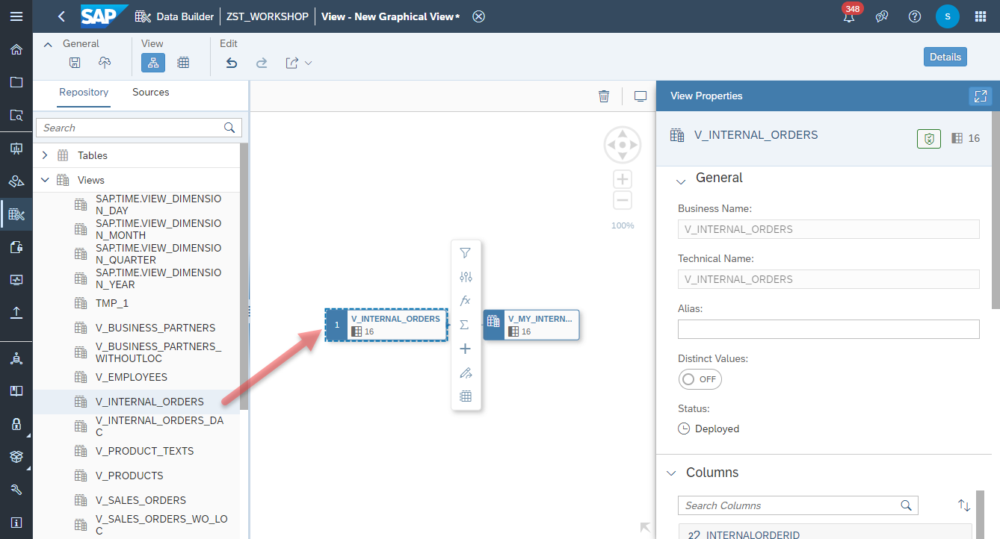
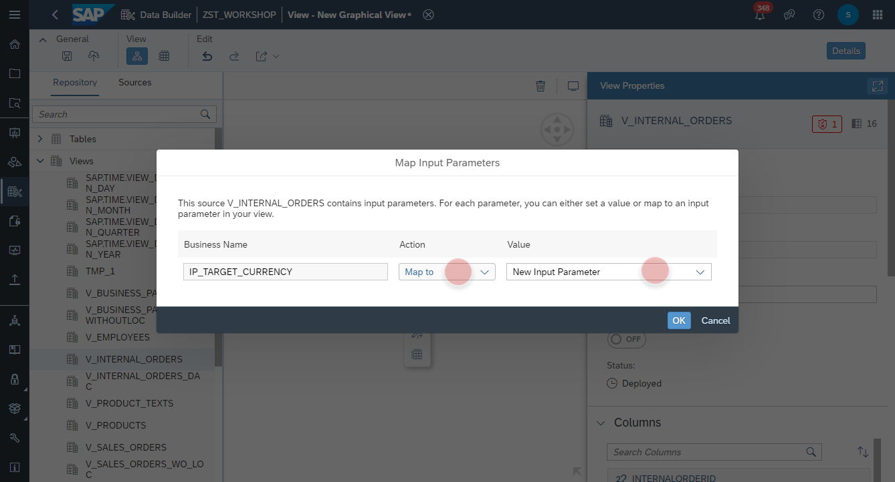
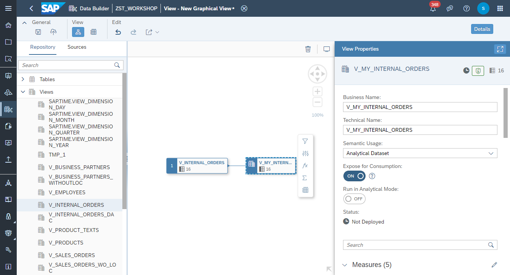
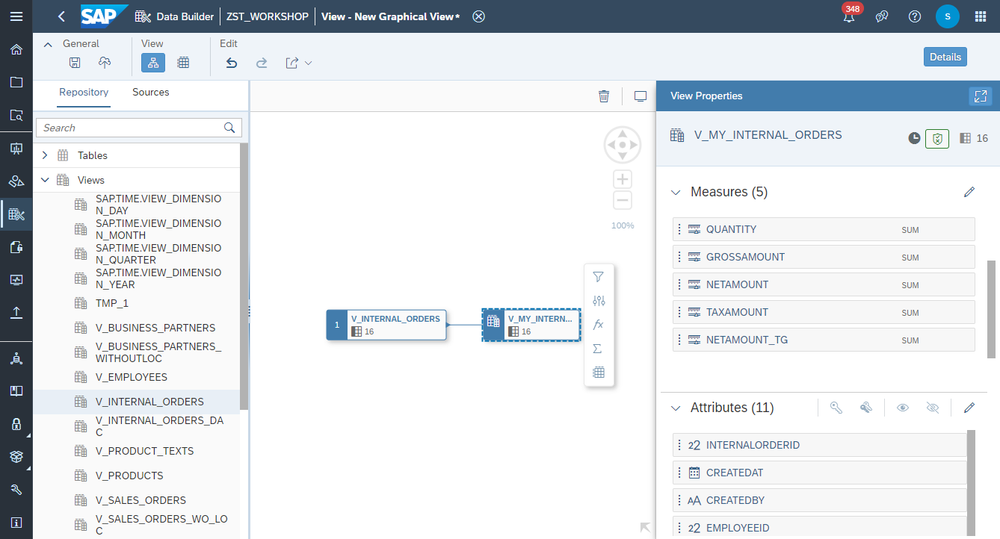
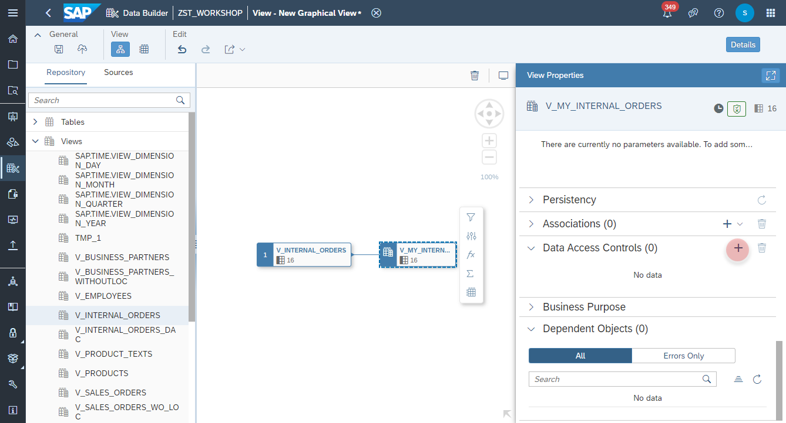
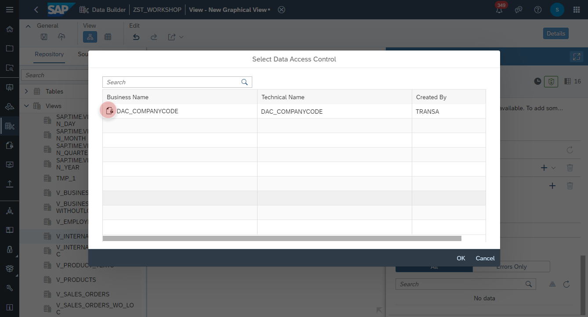
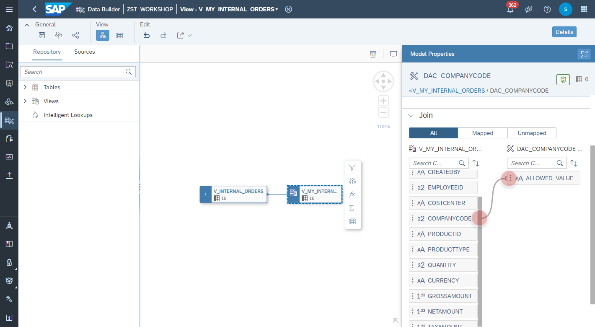
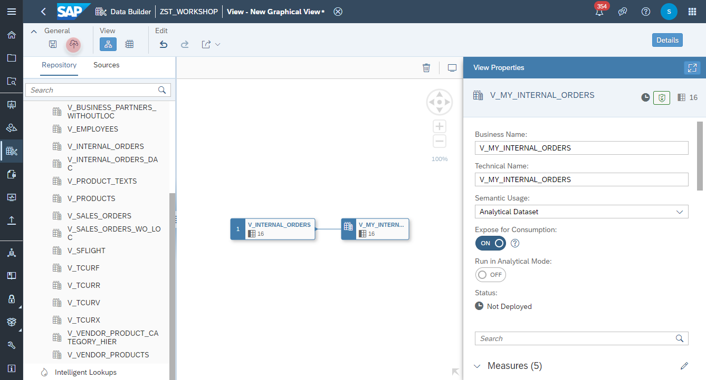
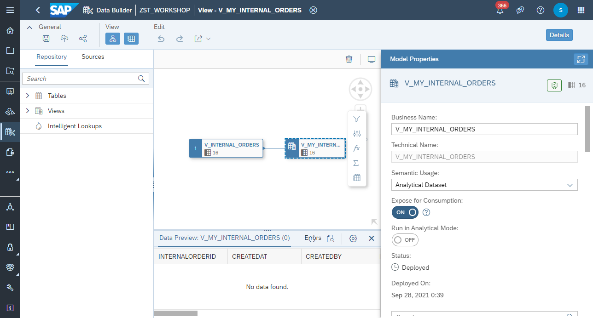

 # Create My Internal Orders View

1. Navigate to the Repository Explorer
2. Click on <b><i>Create - Graphical View</i></b> Button to create a new view
      
3. Drag and drop the view **_V_INTERNAL_ORDERS_** into the canvas, which you have created previously.
  >:mortar_board: **Note**: the properties and semantics from the previous view will be inherited to the new view, such as Measure classification, Attributes Semantics, etc. In the future also Input Parameters, Associations, Text and Hierarchy definitions will be reusable. 
  
    
4. TBD :construction::construction::construction:
    
5. Select the Output Node in the canvas and configure the following properties:
    - Business Name: <b>V_MY_INTERNAL_ORDERS</b>
    - Technical Name: <b>V_MY_INTERNAL_ORDERS</b>
    - Semantic Usage: <b>Analytical Dataset</b>
    - Expose for Consumption: <b>ON</b>
    
    
  
### Data Access Control
6. Navigate to the _Data Access Control_ section and add a new Data Access Control.
    
  
7. Select the Data Access Control **DAC_COMPANYCODE**.
    
  
8. By mapping the Data Access Control **DAC_COMPANYCODE.ALLOWED_VALUE** column to the **V_MY_INTERNAL_ORDERS.COMPANYCODE**, the view will be filtered by the Company Code with the user's allowed values.
    
    
    
    
