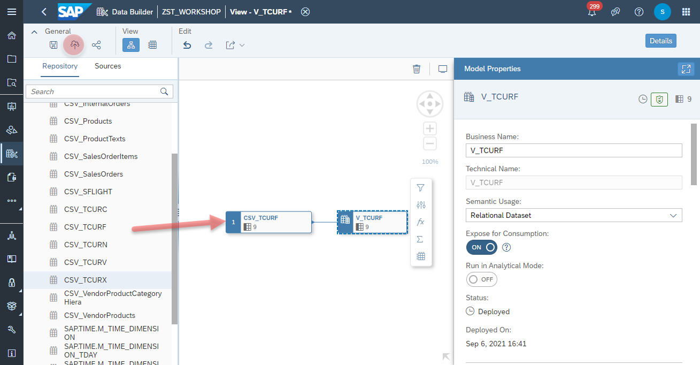

# Create <i>Currency Prefactors</i> View (TCURF)

1. Navigate to the Repository Explorer
2. Click on <b><i>Create - Graphical View</i></b> Button to create a new view
      
3. Drag and drop the table <b><i>CSV_TCURF</i></b> into the canvas
      
4. Select the Output Node in the canvas and configure the following properties:
    - Business Name: <b>V_TCURF</b>
    - Technical Name: <b>V_TCURF</b>
    - Semantic Usage: <b>Relational Dataset</b>
  - Expose for Consumption: <b>on</b>
 4. Click on <b><i>deploy</i></b> button to deploy the view
