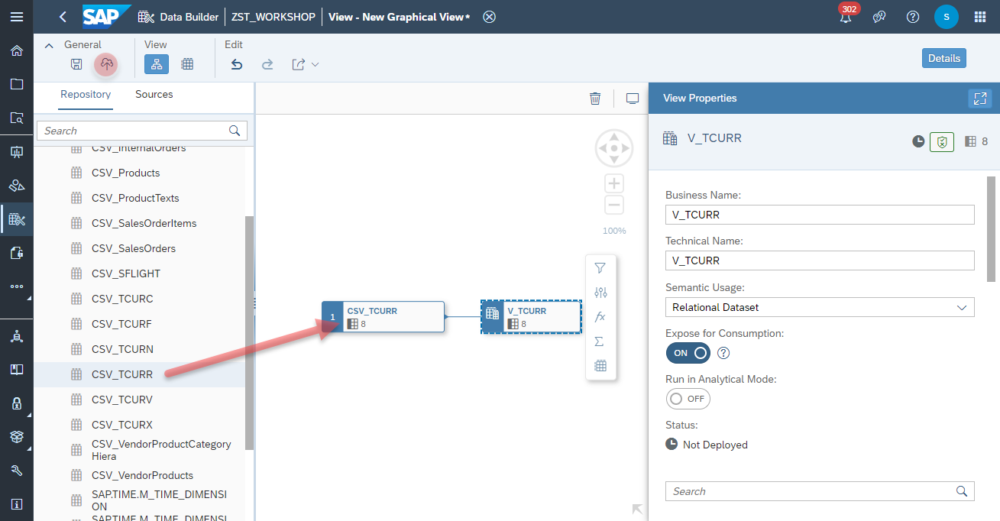

# Create <i>Currency Rates</i> View (TCURR)

1. Navigate to the Space Management
    
2. Drag and drop the table <b><i>TCURR</i></b> into the canvase
3. Click on the Output Node and configure the following properties:
  - Business Name: V_TCURR
  - Technical Name: V_TCURR
  - Semantic Usage: Relational Dataset
  - Expose for Consumption: on
   
 4. Click on <b><i>deploy</i></b> button to deploy the view

