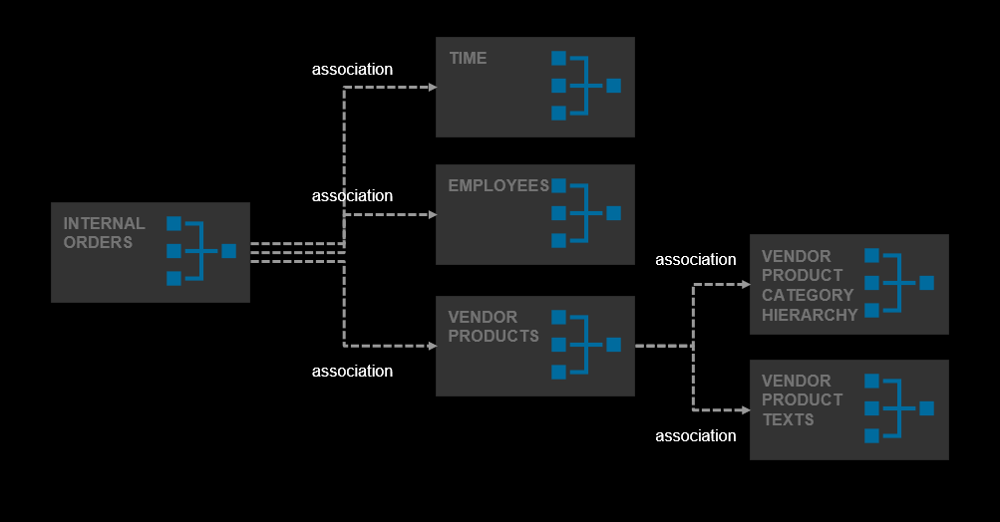

# Level 1 Heading

In this exercise, you will...

## Level 2 Heading

After completing these steps you will have....

1.	Click here.
<br>

2.	Insert this code.
```
 DATA(lt_params) = request->get_form_fields(  ).
 READ TABLE lt_params REFERENCE INTO DATA(lr_params) WITH KEY name = 'cmd'.
  IF sy-subrc <> 0.
    response->set_status( i_code = 400
                     i_reason = 'Bad request').
    RETURN.
  ENDIF.
```

## Summary

Now that you have ... 
Continue to - [Exercise 1 - Exercise 1 Description](../ex1/README.md)
